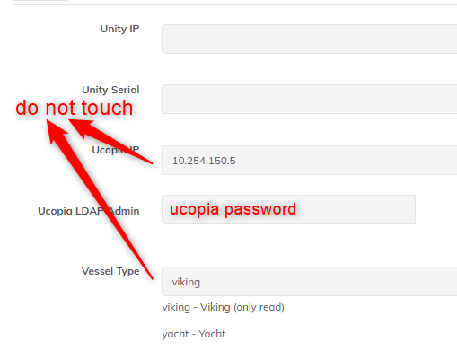
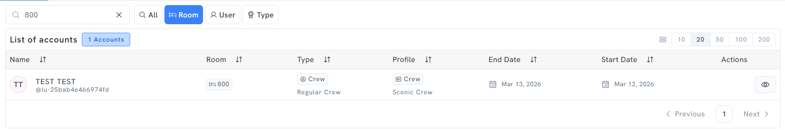
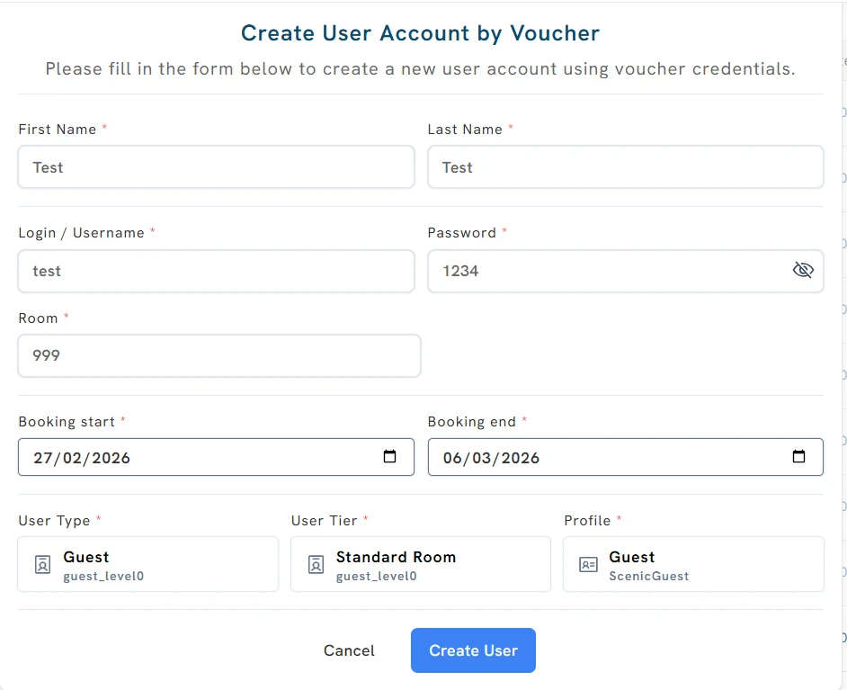

# Source Extract — Unity Local Admin

## Source identity

| Field | Value |
|---|---|
| Page ID | 1566081037 |
| Title | Unity Local Admin |
| Space | Captive Portal (key: `CP`) |
| Author | Luis Pico |
| Last modified | May 28, 2026 |
| URL | https://redevelopment-omniaccess.atlassian.net/wiki/spaces/CP/pages/1566081037/Unity+Local+Admin |
| Site / cloudId | redevelopment-omniaccess / 2f20f3f7-a03f-4292-b888-02a71dc0327e |

**Extraction notes:** 100% of the page body was read (both markdown and HTML formats). All 19 image attachments were downloaded successfully and read visually; descriptions below reflect actual image content. No content was truncated. No PII is reproduced verbatim — guest/crew names visible in screenshots are described generically and noted as `[PII in screenshot]` where relevant.

## Table of contents

1. Local Admin Installation
2. Access
3. Initial notes and recommendations
   - What is the Unity Local Admin?
4. Main functionalities
   - Monitoring (User types and tiers, Profiles, Accounts)
   - Deleting users
   - Creating users (by Room, via Voucher, via Voucher Bulk)
5. Docker - service
6. Appendix: supplementary network diagram attachment

---

## Source page 1566081037 — Unity Local Admin

### 1. Local Admin Installation

Installation/onboarding steps for the Local Admin:

1. **Upgrade Unity to version 4.1.8 (at least).**
2. **Add Ucopia controller in Unity DB with rundeck** → [Ucopia rundeck job](https://omniscripting.omniaccess.com:4443/project/OA_Services/job/show/8707365f-cef8-4114-821c-19faab0b75d8)

   
   Configuration form for the Ucopia controller. Fields: Unity IP, Unity Serial (both annotated **"do not touch"**), **Ucopia IP = `10.254.150.5`**, **Ucopia LDAP Admin = "ucopia password"**, and **Vessel Type = `viking`** (dropdown options shown: `viking - Viking (only read)`, `yacht - Yacht`).

3. **Add CP controller in Unity DB with rundeck** → [Captive Portal rundeck job](https://omniscripting.omniaccess.com:4443/project/OA_Services/job/show/c0035e91-0885-4808-8546-5c70f0a15118)

   
   Configuration form for the CP controller. Fields: Unity IP, Unity Serial (blank), and **Cruise KVM IP = `10.254.149.10`** (annotated **"do not touch"**).

4. **Make sure that User Access Management is visible.**

   
   Unity "Admin page" (user `superadmin`, role UNITY/SUPERADMIN, dated May 28, 10:46 AM). Shows **Permissions** controls (Restore All → "Resync" button; Rebuild Permissions → "Rebuild" button) and a **Features Addons** list of toggles, all enabled: Bonding, Choose My Ip, Connectivity Management, Cybersecurity, Sd Wan, User Cruises Management, **User Access Management** (highlighted with red box), Wan Health, Wan Selection.

### 2. Access

The Unity Local Admin is a set of dashboards in the Unity GUI:

Unity GUI showing the Accounts dashboard. Top tabs: Accounts, Profiles, User Tiers, User Types, Purchases, Consolidations, plus a "Create User" button. Left navigation includes Traffic Shaping, Bonding, and a **USER CRUISES MANAGEMENT** group (Profiles, Accounts, User Tiers, User Types, Purchases, Consolidations) — **Purchases and Consolidations are annotated "not used"**. The accounts table lists ~479 accounts with columns: name, Room, Type (e.g. Guest / Standard Room), Profile (e.g. Guest / Emerald Guest), End Date, Start Date, Actions. [PII in screenshot: guest names.]

> 📝 **NOTE.** Purchases and Consolidation dashboards **DO NOT WORK** on Unity version 4.1.8.

### 3. Initial notes and recommendations

> ⚠️ **WARNING:** Please be aware that this is not a Unity Local Admin guide. The **in-depth technical details should be provided by the Devel team.**

#### What is the Unity Local Admin?

The **Unity Local Admin** is a dashboard in Unity thought to be a **point of visibility and control of the Captive Portal**. It is needed at least **Unity version 4.1.8** to install the Local Admin in Unity.

### 4. Main functionalities

#### Monitoring

There are a few tabs in Unity that provide information regarding the Captive Portal.

##### User types and tiers

Currently there are **2 types of users (Guest and Crew)** and there are **2 tiers per type**:

| User type | Tier (level 0 / default) | Tier (level 1) |
|---|---|---|
| Guest | Standard (Standard Room → `guest_level0`) | VIP (VIP Room → `guest_level1`) |
| Crew | Regular (Regular Crew → `crew_level0`) | Executive (Crew Executive → `crew_level1`) |

"User Types" tab. **Usertype: Guest** — name `guest`, description Guest, default tier `guest_level0`, 2 tiers, **545 users**; associated tiers: Standard Room (`guest_level0`), VIP Room (`guest_level1`). **Usertype: Crew** — name `crew`, description Crew, default tier `crew_level0`, 2 tiers, **55 users**; associated tiers: Regular Crew (`crew_level0`), Crew Executive (`crew_level1`).

##### Profiles

Each of the tiers has a "default" profile assigned that defines its quota, number of max devices, etc. This is only a preconfiguration — it is possible to assign different profiles to every tier. For example, in Scenic/Emerald:

- User tier = Regular Crew → Default profile = Crew
  - User tier = Regular Crew → Available profiles that can be applied = Crew and CrewExecutive

"Profiles" tab grouped "By Guest Type". Profile details:

| Group | Profile Name | User Type | Level | Base Price | Max Devices | Quota | Mxp Id | Day/Week |
|---|---|---|---|---|---|---|---|---|
| Guest: Standard Room | Guest | Guest / Standard Room | 0 | Free | 2 | 20 GB | N/A | 4/2/2026 |
| Guest: VIP Room | GuestVIP | Guest / VIP Room | 1 | Free | 2 | 20 GB | N/A | 4/2/2026 |
| Crew: Regular Crew | Crew | Crew / Regular Crew | 0 | Free | 2 | 2 GB | N/A | 4/2/2026 |
| Crew: Crew Executive | CrewExecutive | Crew / Crew Executive | 1 | Free | 2 | 5 GB | N/A | 4/2/2026 |

**Accounts:** this is the main dashboard for user monitoring. You can see room, profile, start and end date of the cruise. Clicking the **Eye button** on the right shows detail per user.

Accounts list (473 accounts) with a red arrow pointing at the **Eye (view) action** in the Actions column, used to open the per-user detail view. [PII in screenshot: guest names.]

- **Per user view:** information from user, profile, quota and device traffic.

  
  Per-user detail page. Left **USER ACTIONS** (Extend Validity, Block User, Kick User, Delete User), **PROFILE ACTIONS** (Change Profile), **DEVICE ACTIONS** (Add Device, Remove Device). Center "Information from Guest": Status Active, Room 208, User Tier Standard Room, Type Guest, Profile Guest, Valid from 09/03/2026 to 16/03/2026; "Profile Info": Profile Name Guest, Profile Status Enabled, User Type Guest, Controller Profile `Guest - guest_level0`, Profile Level 0. Right **Quota** ring: **1.06 GB used / 20.00 GB contracted (5.3%)**, next renewal in 6 hours; Table of Devices lists two device MACs (Offline, 0 sessions); Top Apps (48h): no data. [PII in screenshot: one guest name, username and device MACs.]

#### Deleting users

This functionality deletes the user details in the CP Database **and also in Ucopia**. Deletes the user completely from the system.

Same per-user detail page as above with the **"Delete User"** action (under USER ACTIONS) highlighted in a red box.

#### Creating users

The following methods **do not use CruisePAL** to authenticate the users. The users are created in the Captive Portal database. The "Create User" button offers three options: **Create User by Room**, **Create User by Voucher**, **Create Users by Voucher (Bulk)**.

##### Creating user by Room

This will create a user with a firstname, lastname and room number associated.

The "Create User" dropdown with three options; **"Create User by Room"** highlighted.

"Create User Account by Room" modal. Required fields: First Name, Last Name, Year of birth (e.g. 1998), Room (e.g. 800), Booking start / Booking end dates, User Type (Crew / `crew_level0`), User Tier (Regular Crew / `crew_level0`), Profile (Crew / ScenicCrew). "Create User" button.

- **Format of the user created:**

  
  Accounts list filtered by Room "800" returning 1 account: "TEST TEST" with username **`@lu-25bab4e466974fd`**, Room 800, Type Crew / Regular Crew, Profile Crew / Scenic Crew, dates Mar 12 → Mar 13, 2026. (Room-created usernames take the form `lu-<random hash>`.)

##### Creating user via Voucher

This will create a pair of username/password.

"Create User" dropdown with **"Create User by Voucher"** highlighted; accounts list shows 473 accounts (e.g. `lu-guest-030` … Standard Room / Scenic Guest).

"Create User Account by Voucher" modal. Fields: First Name, Last Name, **Login/Username** (e.g. `test`), **Password** (e.g. `1234`), Room (e.g. 999), Booking start/end, User Type (Guest / `guest_level0`), User Tier (Standard Room / `guest_level0`), Profile (Guest / ScenicGuest).

- **Format of the user created:**

  
  Accounts list filtered by "test" returning 1 account: "Test Test", username **`@lu-test`**, Room 999, Guest / Standard Room, Profile Guest / Scenic Guest, dates Feb 27 → Mar 6, 2026. (Voucher username takes the form `lu-<login>`.)

##### Creating user via Voucher (Bulk)

This will create a bulk of username/password combinations. It also generates a **CSV** that you can download and provide to the Hotel Manager (or he can download it himself).

> ⚠️ **WARNING:** Please create the **Login Prefix/Seed in lowercase letters** — currently there is a bug with Uppercase.

"Create User Accounts by Voucher (Bulk)" modal. **Common Settings:** Booking Start/End, User Type (Guest / `guest_level0`), User Tier (Standard Room / `guest_level0`), Profile (Guest / ScenicGuest). **User Generation:** Login Prefix/Seed (e.g. `guest`, annotated **LOWERCASE**), Start # (1), Quantity (3), Pass Length (8), "Use same password for all users" checkbox, **Generate** button (step 1), Import option, **Review Users** button (step 2).

"Users Created Successfully" confirmation: "Successfully created 3 user accounts." with a **"Download Credentials (CSV)"** button (highlighted). Generated credentials shown as Login/Password pairs and the CSV layout (columns Login, Password). [Example login prefixes `guest-900..902`; passwords are example/test values — treated as non-operational.]

- **Format of the user created:**

  
  Three resulting accounts: `lu-guest-900`, `lu-guest-901`, `lu-guest-902`, all Guest / Standard Room, Profile Guest / **Emerald Guest**, dates Feb 27 → Mar 6, 2026. (Bulk usernames take the form `lu-<prefix>-<number>`.)

### 5. Docker - service

| Service | Image |
|---|---|
| user-cruise-services | `gitlab.omniaccess.com:5001/development/cartels/cruise-portal:1.4.47` |
| user-quota-services | `gitlab.omniaccess.com:5001/development/unity/cartels/ucopia:feat-oae-1406.1` |

### 6. Appendix — supplementary network diagram (attachment, not inline in body)

A drawio network diagram is attached to the page but not embedded in the body. Included here for completeness.

Network topology: **MIKROTIK** (`.2`) connects via VLAN 199 (`10.254.199.0/24`) to a **FORTIGATE** firewall (`.1`). Inside FORTIGATE: VRF 0 (with `transit2_vrf_30 .1`, `uc_in .2`, `uc_mgmt .1`) and an inner VRF 30 (`transit2_vrf_0 .2`, `uc_out .1`). VRF 0 reaches the **INTERNET**. **vmbr1** connects via VLAN 155. **UCOPIA** connects via: OUT (`.2`) ↔ uc_out over VLAN 151; IN (`.1`) ↔ uc_in over VLAN 149; MGMT (`.5`) ↔ uc_mgmt over VLAN 150.

---

## Per-page Images table

All images saved under `agents_back/agents_directory/images/1cb94c7f-2066-47c6-90c1-426eac6ba76e/`. All downloaded OK.

| # | File | Media data-id | Dimensions (px) | What it shows |
|---|---|---|---|---|
| 1 | 1566081037-1-image-20260528-094132.png | 40ea931e-2899-4bd0-ab8a-44305872456b | 520×800 | Admin page Features Addons; User Access Management toggle |
| 2 | 1566081037-2-image-20260505-104845.png | 0e8660f8-f2ec-4e4e-8b46-91d180261adc | 378×195 | CP controller rundeck form (Cruise KVM IP 10.254.149.10) |
| 3 | 1566081037-3-image-20260505-104756.png | 74904f62-144e-445b-95bb-e662669cd38b | 509×400 | Ucopia controller rundeck form (Ucopia IP 10.254.150.5) |
| 4 | 1566081037-4-Untitled Diagram-1773421167195.drawio.png | (attachment, not in body) | — | Fortigate/Ucopia/Mikrotik VLAN network diagram |
| 5 | 1566081037-5-image-20260314-004354.png | 23f45aff-4b6f-4f9d-9fa5-a00bf17eee6d | 1900×907 | Accounts dashboard + left nav (Purchases/Consolidations "not used") |
| 6 | 1566081037-6-image-20260312-104656.png | a95b6be1-2c37-46b9-89f8-810fa8ed4f8e | 1024×141 | Bulk-created accounts (lu-guest-900..902, Emerald Guest) |
| 7 | 1566081037-7-image-20260312-104633.png | bd75f554-ea3f-4714-9a46-e49aa66e4105 | 1024×585 | "Users Created Successfully" + Download Credentials CSV |
| 8 | 1566081037-8-image-20260312-104614.png | b7a26645-9beb-47d8-9c82-070597029204 | 1024×678 | Create Users by Voucher (Bulk) form (LOWERCASE seed) |
| 9 | 1566081037-9-image-20260312-104545.png | 1e3fd497-2462-4de7-9ce5-b489a0833e6b | 1024×174 | Voucher-created account row (@lu-test) |
| 10 | 1566081037-10-image-20260312-104514.png | 78735efc-518b-4e3b-9784-12205d21d350 | 942×767 | Create User Account by Voucher form |
| 11 | 1566081037-11-image-20260312-104447.png | f3f24049-5c71-49ed-a2cc-3671f9673cbd | 1024×500 | Create User dropdown; "by Voucher" highlighted |
| 12 | 1566081037-12-image-20260312-104847.png | a834019a-c238-4dbf-af8b-a929b2d89534 | 1955×326 | Room-created account row (@lu-25bab4e466974fd) |
| 13 | 1566081037-13-image-20260312-104805.png | 368e484b-c880-4ab5-aa06-fc74cfbb21a5 | 1001×832 | Create User Account by Room form |
| 14 | 1566081037-14-image-20260312-104922.png | d7d37914-d26e-4cf9-8fa1-3b868372459d | 1958×918 | Create User dropdown; "by Room" highlighted |
| 15 | 1566081037-15-image-20260312-103920.png | 972633be-c36b-425f-ba25-84b304a162f8 | 1955×845 | Per-user view; Delete User action highlighted |
| 16 | 1566081037-16-image-20260312-103330.png | 4ef72bbb-68c9-4f1d-87bf-44fcaf48ee2d | 1955×845 | Per-user detail view (quota, devices, actions) |
| 17 | 1566081037-17-image-20260312-103031.png | 30d6fb39-df5d-4997-b4ec-dde4a9eb0e29 | 1958×972 | Accounts list; Eye (view) action highlighted |
| 18 | 1566081037-18-image-20260312-102551.png | 051ff932-25cf-4c49-8402-1a8cc2a9848a | 1964×905 | Profiles dashboard (quota/max devices per profile) |
| 19 | 1566081037-19-image-20260312-102232.png | 94446078-c4ce-45e0-9983-13bfaeb82c01 | 1968×954 | User Types dashboard (Guest 545 users, Crew 55 users) |
