# Source Extract — Ucopia Captive Portal (Bugs & Version Upgrade)

> Combined faithful extract of two Confluence pages from the "Captive Portal" (CP) space.
> **Images:** all 17 screenshots were downloaded via the authenticated Confluence
> media API and visually read; each is embedded inline at its source position with
> a description of its actual content, and listed with full metadata in the
> per-page "Images" tables. Files live in `images/73eead49-afb7-4f90-a731-cb8a5564bd86/`.
> Personal data (crew/guest names, cabin/login numbers, individual MAC addresses)
> is omitted from descriptions; operational identifiers (serial number, versions)
> are kept because the procedures require them.

## Combined Table of Contents

- **Page 1 — Ucopia Bugs** (id 1570865158)
  1. DHCP leases stop working
  2. MAC "unknown" – "Cannot find profile" error
  3. Ulog file too big
  4. Only one user passing traffic after activating a License Advance 1000
  5. DHCP 252 Option
  6. v7.2.8 – Lost access to LDAP
- **Page 2 — Ucopia version upgrade** (id 1603764386)
  1. Warnings and requirements
  2. Ucopia versions approved
  3. Pre-checks and previous actions
  4. Automatic upgrade process

---

# PAGE 1 — Ucopia Bugs

- **Page ID:** 1570865158
- **Space:** Captive Portal (CP)
- **Last modified:** May 27, 2026
- **URL:** https://redevelopment-omniaccess.atlassian.net/wiki/spaces/CP/pages/1570865158/Ucopia+Bugs

This page summarizes all known Ucopia bugs. There are 3 concurrent problems that need direct bypassing of the usual troubleshooting; see below each one and the steps Tier 1 needs to perform directly.

## 1. DHCP leases stop working

### Symptoms
DHCP leases are decreasing or becoming 0; few sessions are seen, and customers complain that guests/crew have no internet. Since the IP is not properly leased, the Captive Portal jumps constantly asking to introduce the data (re-prompts for login).

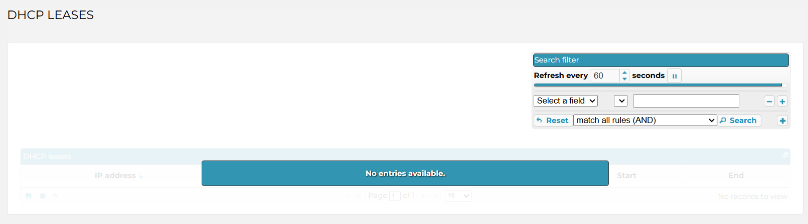
*The Ucopia "DHCP LEASES" monitoring screen. The leases table shows a blue "No entries available." banner with "No records to view" — i.e. zero active leases. A "Search filter" panel (top-right) is set to refresh every 60 seconds. This is the visual confirmation that leases have dropped to 0.*

**NOTE:** This also appears to happen after failure of the main Unity server — backup failover fails on the Ucopia. This leads to a situation where the MySQL database of Ucopia gets corrupted and Ucopia is not able to operate. Ucopia stops providing IP addresses to DHCP clients, and users cannot connect until the DHCP server is recovered.

### Workaround
**WORKAROUND TO APPLY** → Escalate to Ucopia (following the escalation page, CP id 1566998545) and **call them directly**. Ucopia reported that sometimes one of the DHCP services inside Ucopia gets stuck, and the system believes it is UP so it doesn't restart it and everything fails because of it. They **need to manually restart the service for it to start working again**.

A definitive fix is still pending.

## 2. MAC "unknown" – "Cannot find profile" error

### Symptoms
Users are using valid credentials and are not able to login to internet, because Ucopia is not able to allow access. When trying to establish the session with Ucopia, the user never gets approval because for some unknown reason its MAC address is not present in the DHCP leases. Surprisingly, this client initially had its current IP address from the Ucopia; however, for some reason, the **IP assignation was not saved into the MAC address table of Ucopia**. This problem has been seen happening on IP address renewal — the process that stores the MAC address is not working, while the user gets a new renewal period for that same IP address.

- **Ucopia logs:** DHCP negotiation is OK but then the MAC is lost.

```
2026 Jan  6 22:11:10 localhost dhcpd[1837]: DHCPDISCOVER from 1e:4b:5f:39:0e:f4 via 10.11.136.1
2026 Jan  6 22:11:10 localhost dhcpd[1837]: DHCPOFFER on 10.11.136.57 to 1e:4b:5f:39:0e:f4 via 10.11.136.1
2026 Jan  6 22:11:11 localhost dhcpd[1837]: DHCPREQUEST for 10.11.136.57 (10.254.149.1) from 1e:4b:5f:39:0e:f4 via 10.11.136.1
2026 Jan  6 22:11:11 localhost dhcpd[1837]: DHCPACK on 10.11.136.57 to 1e:4b:5f:39:0e:f4 via 10.11.136.1
---->>> Starting here MAC is lost <<<-------
2026 Jan  6 22:11:14 controller authserver[4326]: {tid=104739} [DEBUG] ... received parameters: MAC: null, IP: 10.11.136.57, userId: , keyword: MODTEST ...
2026 Jan  6 22:11:14 controller authserver[4326]: {tid=104739} [DEBUG] ... getMACFromIP: No network entry retrieve from ARP / ipset. Try with OOB information
2026 Jan  6 22:11:14 controller authserver[4326]: {tid=104739} [DEBUG] ... getMACFromIP: Mac address from network entry not found.
2026 Jan  6 22:11:14 controller authserver[4326]: {tid=104739} [NOTICE] Core.PortalUser |-|10.11.136.57: prepareNetworkEntry: We don't have mac address but keep trying to get zone Id
2026 Jan  6 22:11:14 controller authserver[4326]: {tid=104739} [DEBUG] Core.PortalUser |-|10.11.136.57: network matching succeeded for IP address: 10.11.136.57. The incomingNetworkID is: subnet3 (Viking Sea 4)
2026 Jan  6 22:11:14 controller authserver[4326]: {tid=104739} [INFO] ... setTenantIdFromIncomingZoneId: get tenant ID [null] from incoming zone
2026 Jan  6 22:11:14 controller authserver[4326]: {tid=104739} [DEBUG] ... MODTEST: returnCode 10003, no user account found with this IP and/or MAC address
2026 Jan  6 22:11:14 controller authserver[4326]: {tid=104739} [DEBUG] CoreAuthServer: thread 104739 unRegistered, total=0
```

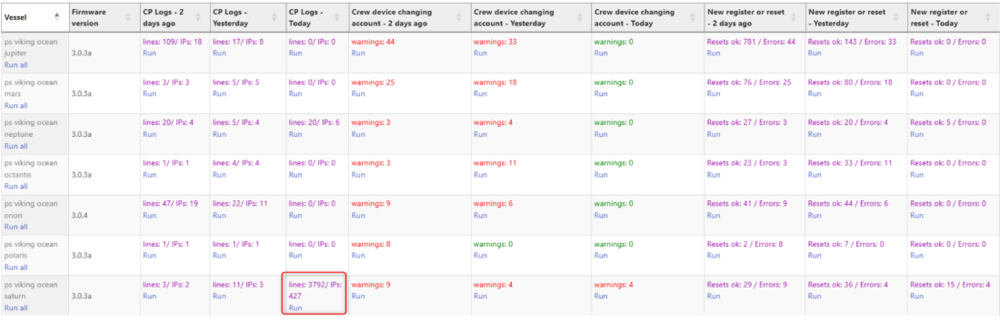
*A Unity fleet dashboard table, one row per vessel, with columns for Firmware version, "CP Logs" (lines / IPs for 2-days-ago / yesterday / today), "Crew device changing account" warnings, and "New register or reset" (Resets ok / Errors). One row is highlighted in red where today's CP Logs spike to "lines: 3792 / IPs: 427" — the burst of log lines/warnings in a short period that signals this bug is occurring.*

Rule of thumb: if **there are a lot of warning errors, or a few but all of them in a short period of time**, this issue is probably happening and you need to directly escalate to Ucopia and contact them via phone. At the moment all of the tunnels on the VOCs are enabled, so you only need to provide the **serial number**, which can be obtained via CLI when logging in, or via WebGUI under the **Maintenance → Remote Services** tab (the same tab where you enable the tunnel — see the Remote Services screenshot under Bug 3, which shows the serial number and the tunnel ports).

### Workarounds
- Ucopia applied a workaround on VOC consisting of an optimization on the main database → **Proved not to work OK.**

**WORKAROUND TO APPLY** → Escalate to Ucopia (CP id 1566998545) and **call them directly**. They reported that sometimes one of the DHCP services inside Ucopia gets stuck, and the system believes it is UP so it doesn't restart it and everything fails. They **need to manually restart the service**.

A definitive fix is still pending.

## 3. Ulog file too big

### Symptoms
Entering the Ucopia WebGUI shows this warning at the top right of the screen:

> "The disk space reserved for logging is nearly full, please configure an automated FTP export for the logs."

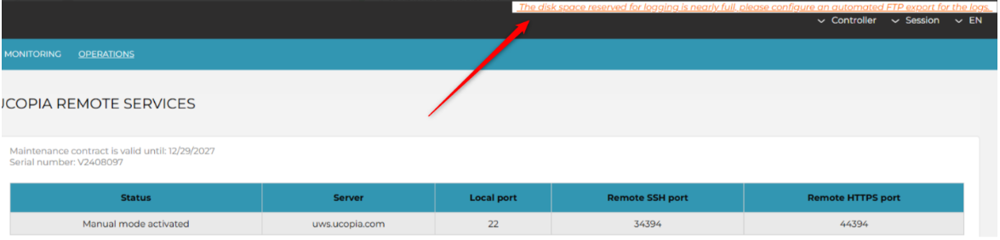
*Top-right of the Ucopia GUI shows the orange warning banner "The disk space reserved for logging is nearly full, please configure an automated FTP export for the logs." The page open is **Operations → Maintenance → Remote Services** ("UCOPIA REMOTE SERVICES"), which displays the maintenance contract validity, the **Serial number** (format like `V24xxxxx`), and a table with Status ("Manual mode activated"), Server (`uws.ucopia.com`), Local port (22), Remote SSH port and Remote HTTPS port — i.e. the same tab used to read the serial and enable the support tunnel.*

It means the "ulog" database is consuming all the disk. Ensure this is still the situation, since this message may not be cleared even though the database could be in good load. To verify, go to:

**Monitoring → System logs → Resources usage**

If the graph **"Log partition"** is showing a value between **20 GB and 30 GB**, then there is a problem and Ucopia needs to be contacted requesting to **drop and re-create the table**.

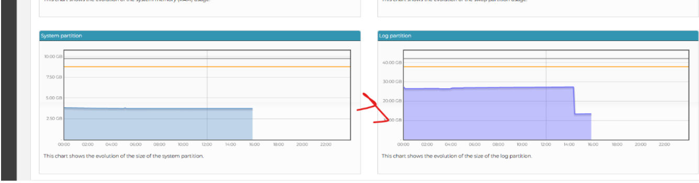
*Two area charts side by side under "Resources usage". Left: "System partition" (~4 GB, well under its ~9 GB orange threshold line). Right: "Log partition", sitting around 25 GB for most of the day against a 40 GB scale, then dropping sharply to ~10 GB after Ucopia's intervention (drop-and-recreate of the table). A red arrow points at the Log partition chart. This confirms the 20–30 GB problem range described in the text.*

Another symptom is that the **Unity tab regarding the Ucopia Accounts stops working**.

### Workaround
**WORKAROUND TO APPLY** → Escalate to Ucopia (CP id 1566998545) and **call them directly**.

## 4. Only one user passing traffic after activating a License Advance 1000

### Symptoms
Sometimes after activating a License Advance 1000, the Ucopia is only capable of passing traffic with the **first user connected**. So if there are several users registered successfully, only the first will be able to pass traffic (in the example, only the `QoECrewStandard` profile).

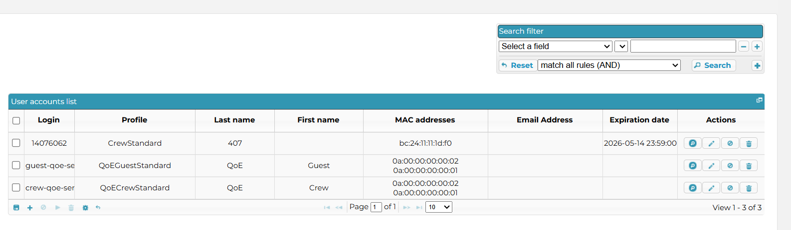
*The Ucopia "User accounts list" with three rows registered successfully, each with a Login, Profile, MAC address(es) and per-row action buttons. The visible profiles are `CrewStandard`, `QoEGuestStandard` and `QoECrewStandard`. All three are registered, but only the first connected user actually passes traffic. (Individual logins/cabin numbers/MACs omitted as PII.)*

The other devices connected **will be able to register to the portal, but not to access internet**. The portal probably keeps popping up.

Doing a sniffer of the traffic from a device with no internet on the Fortigate, you will see traffic entering `uc_in` but not going out via `uc_out`.

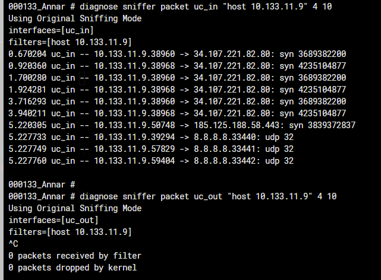
*A Fortigate CLI sniffer. The first command `diagnose sniffer packet uc_in "host <client-ip>" 4 10` shows many outbound SYN / UDP packets from the affected client (to 34.107.221.82:80, 185.125.188.58:443, 8.8.8.8 …) — traffic IS entering the `uc_in` interface. The second command `diagnose sniffer packet uc_out "host <client-ip>" 4 10` is stopped with `^C` and reports **"0 packets received by filter, 0 packets dropped by kernel"** — nothing leaves `uc_out`. This proves the Ucopia drops the traffic instead of forwarding it.*

### Workaround
**WORKAROUND TO APPLY** → Escalate to Ucopia (CP id 1566998545).

## 5. DHCP 252 Option

### Tickets
- CP Eng → Freshdesk ticket 399628
- Ucopia escalation → Freshdesk ticket 401196

### Symptoms
Windows devices receive an IP address but then the Captive Portal takes too long to pop up, or never pops. Instead, the browser shows a URL with a blank page.

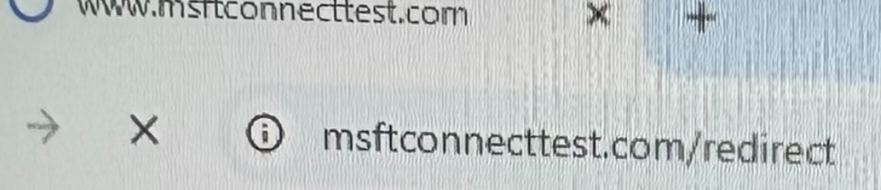
*A browser tab whose address bar shows `msftconnecttest.com/redirect` (the Windows network-connectivity-check URL) — instead of redirecting to the Ucopia captive portal, the browser is stuck on this connectivity-test URL.*

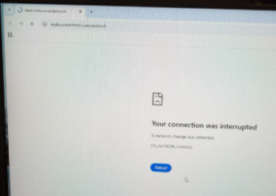
*The resulting browser error page: a sad-document icon with "Your connection was interrupted — A network change was detected. ERR_NETWORK_CHANGED" and a blue "Reload" button. This is the blank/error page the user sees instead of the portal.*

The main problem seems to be **DHCP option 252**, a custom DHCP parameter used to distribute Web Proxy Auto-Discovery (WPAD) configuration files to clients. The Windows device tries to pull a `wpad.dat` file from Ucopia that does not exist, and keeps loading for a very long time until it hits timeout or shows the blank page.

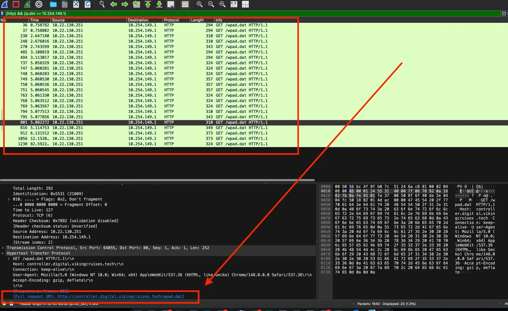
*A Wireshark capture (HTTP packets highlighted in green) showing the Windows client repeatedly issuing HTTP `GET /wpad.dat` requests, with the packet-detail/hex panes below and the `wpad` request URL highlighted in red — confirming the client is chasing the WPAD file advertised by DHCP option 252.*

To fix this, Ucopia was requested to **disable option DHCP 252** (only in VOC Mira).

### Workaround
**WORKAROUND TO APPLY** → Call Ucopia and request to **disable DHCP option 252**.

## 6. v7.2.8 – Lost access to LDAP

### Tickets
- CP Eng → Freshdesk ticket 402008
- T1 → Freshdesk ticket 402226

### Symptoms
Unity is sending "kick user for quota sync" every 5 minutes for all CP users. In Ucopia it can be seen that sessions are cut. In CP, many messages appear using "kick user for quota sync".

In CP, if the Unity IP is removed from the API whitelist (to stop Unity making any API call), an **"Unauthorized admin request"** message from the Unity IP appears every 5 minutes.

After disabling Unity, the kicks stop. Current sessions are then longer, not being cut.

> *(The four screenshots in this section are hosted externally on Freshdesk via temporary signed tokens, not as Confluence attachments, so they are not part of the page's attachment set and were not downloadable. They show: Ucopia sessions being cut; CP "kick user for quota sync" log spam; the recurring "Unauthorized admin request" message from the Unity IP; and longer/uninterrupted sessions after Unity was disabled.)*

### Workaround
**WORKAROUND TO APPLY** → Call Ucopia and request to **apply the fix in LDAP access**.

### Images — Page 1 (1570865158)

| Section | Saved file | Source filename | Dimensions | Shows |
|---------|-----------|-----------------|-----------|-------|
| Bug 1 | `1570865158-8-image-20260316-154038.png` | image-20260316-154038.png | 1611×448 | DHCP LEASES screen, empty table ("No entries available.") |
| Bug 2 | `1570865158-9-image-20260316-153448.png` | image-20260316-153448.png | 1100×354 | Unity fleet dashboard; warning/log-line burst highlighted |
| Bug 3 | `1570865158-7-image-20260316-155045.png` | image-20260316-155045.png | 1175×283 | Logging-full warning banner + Remote Services tab (serial, tunnel ports) |
| Bug 3 | `1570865158-6-image-20260316-155249.png` | image-20260316-155249.png | 1336×352 | System vs Log partition usage graphs (~25 GB → drop) |
| Bug 4 | `1570865158-5-image-20260513-063552.png` | image-20260513-063552.png | 1586×464 | User accounts list, 3 registered profiles |
| Bug 4 | `1570865158-4-image-20260513-063833.png` | image-20260513-063833.png | 641×472 | Fortigate sniffer: traffic on uc_in, none on uc_out |
| Bug 5 | `1570865158-1-dhcp_252_wrong_url.png` | dhcp_252_wrong_url.png | 969×209 | Address bar stuck on msftconnecttest.com/redirect |
| Bug 5 | `1570865158-2-dhcp_252_error_message.png` | dhcp_252_error_message.png | 340×242 | "Your connection was interrupted" (ERR_NETWORK_CHANGED) |
| Bug 5 | `1570865158-3-image-20260525-092328.png` | image-20260525-092328.png | 1400×860 | Wireshark capture of repeated GET /wpad.dat |

---

# PAGE 2 — Ucopia version upgrade

- **Page ID:** 1603764386
- **Space:** Captive Portal (CP)
- **Last modified:** Apr 29, 2026
- **URL:** https://redevelopment-omniaccess.atlassian.net/wiki/spaces/CP/pages/1603764386/Ucopia+version+upgrade

## Warnings and requirements

> ⚠️ **WARNING** → The upgrade process takes 10–15 min (with 1–2 min of internet outage, while the Ucopia reboots).

## Ucopia versions approved

The versions approved by Solutions Architecture that have been tested and are approved to be installed are:

- **VRC** → 7.2.8
- **Scenic / Emerald RC** → 7.2.8
- **VOC** → 7.2.4 and 7.2.5

## Pre-checks and previous actions

Access Proxmox and perform a **VM Backup**, adding the tag `UC_BackupBeforeUpdateToV…`.

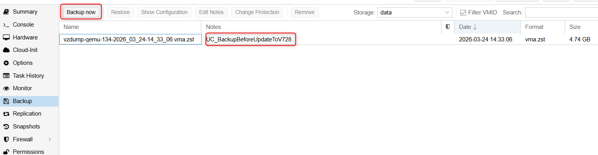
*The Proxmox VM "Backup" tab. The "Backup now" button (top-left) is highlighted, and a completed backup row is shown — `vzdump-qemu-134-2026_03_24-14_33_06.vma.zst`, format `vma.zst`, ~4.74 GB — with its Notes field highlighted showing the tag **`UC_BackupBeforeUpdateToV728`**. This is the pre-upgrade VM backup the procedure requires.*

## Automatic upgrade process

The upgrade process is the same as explained in the Ucopia Manual (see Ucopia Manuals → Administration guide, CP id 1572044805).

> **NOTE** → The upgrade of the controller preserves the configuration (profiles, users, etc.).

> ⚠️ **WARNING** → This method upgrades automatically to the latest version of firmware available. **You cannot choose the version.**

Steps:

1. To upgrade the Ucopia version, enter the Ucopia GUI and access **Operations → Maintenance → Update**.

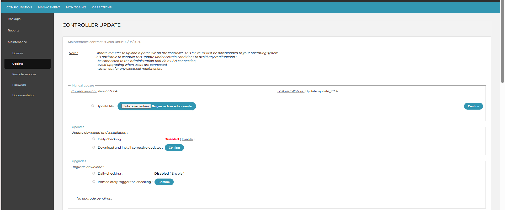
*The "CONTROLLER UPDATE" page (Operations → Maintenance → Update). A Note warns that the update uploads a patch file and advises being on a LAN connection, avoiding upgrades while users are connected, and watching for electrical malfunction. "Manual update" shows **Current version: Version 7.2.4** / Last installation: update_7.2.4. Below are the "Updates" (corrective) and "Upgrades" sections, both with **Daily checking: Disabled** and "No upgrade pending…".*

2. In the **Updates** section, change the toggle from **Disabled** to **Enabled**, and click **Confirm**. This starts downloading all Ucopia versions until the newest.

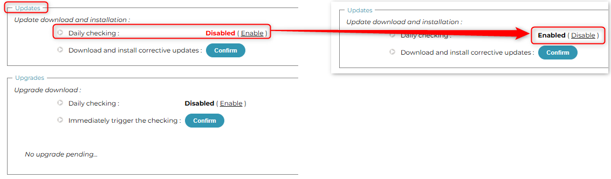
*Close-up of the "Updates → Update download and installation" block: "Daily checking: **Disabled** (Enable)" with a "Download and install corrective updates: Confirm" button. The "Enable" link is the toggle to switch on.*

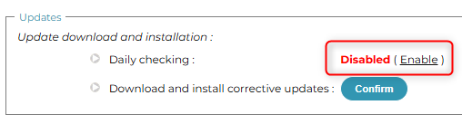
*A before → after composite: left shows "Daily checking: **Disabled** (Enable)"; a red arrow leads to the right showing "Daily checking: **Enabled** (Disable)" — confirming the toggle has been switched on.*

3. **IMPORTANT WARNING!** → Once you reach the desired version, **disable the automatic updates!** (toggle "Daily checking" back to **Disabled**).


*The same "Updates" block back in the **Disabled (Enable)** state — the end state you must leave it in once the target version is reached, so the controller stops auto-updating.*

4. The Ucopia starts showing messages informing about the process.

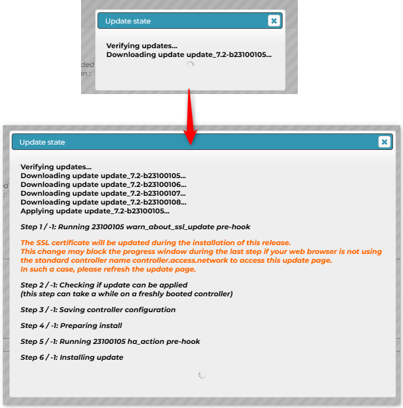
*The "Update state" progress dialog. It lists "Verifying updates…" then multiple "Downloading update update_7.2-b23100105/106/107/108…" lines, then "Applying update…", followed by numbered steps: Step 1 runs a `warn_about_ssl_update` pre-hook (orange warning that the SSL certificate will be updated and may block the progress window on the last step if the browser is not using the standard controller name `controller.access.network` — refresh the update page in that case), Step 2 "Checking if update can be applied (can take a while on a freshly booted controller)", Step 3 "Saving controller configuration", Step 4 "Preparing install", Step 5 `ha_action` pre-hook, Step 6 "Installing update".*

This chains upgrades and goes through all versions of Ucopia:

`7.2.4 → 7.2.5 → 7.2.6 → 7.2.7 → 7.2.8`

You can monitor the version you are on in the same dashboard.

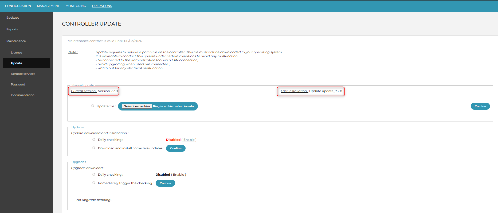
*The same "CONTROLLER UPDATE" page after the chain completes: "Manual update" now shows **Current version: Version 7.2.8** and **Last installation: update_7.2.8** (both highlighted in red) — confirming the controller reached the target version. Updates/Upgrades "Daily checking" should now be Disabled.*

### Images — Page 2 (1603764386)

| Step | Saved file | Source filename | Dimensions | Shows |
|------|-----------|-----------------|-----------|-------|
| Pre-checks | `1603764386-1-image-20260325-083351.png` | image-20260325-083351.png | 1524×397 | Proxmox VM backup with `UC_BackupBeforeUpdateToV728` tag |
| Step 1 | `1603764386-8-image-20260324-142104.png` | image-20260324-142104.png | 1925×801 | Controller Update page, current version 7.2.4 |
| Step 2 | `1603764386-5-image-20260324-144717.png` | image-20260324-144717.png | 1133×334 | Updates "Daily checking: Disabled (Enable)" close-up |
| Step 2 | `1603764386-3-image-20260324-144950.png` | image-20260324-144950.png | 508×137 | Before/after: Daily checking Disabled → Enabled |
| Step 3 | `1603764386-4-image-20260324-144945.png` | image-20260324-144945.png | 508×137 | Daily checking returned to Disabled |
| Step 4 | `1603764386-6-image-20260324-144638.png` | image-20260324-144638.png | 686×694 | "Update state" dialog: chained downloads + install steps |
| Monitor | `1603764386-2-image-20260324-145033.png` | image-20260324-145033.png | 1865×800 | Controller Update page, current version 7.2.8 |
