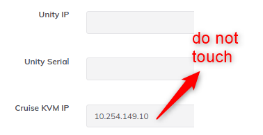
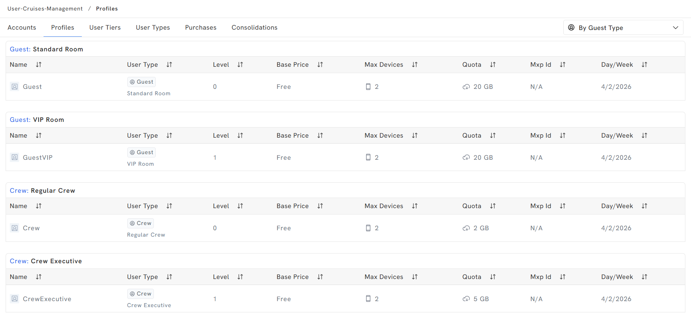
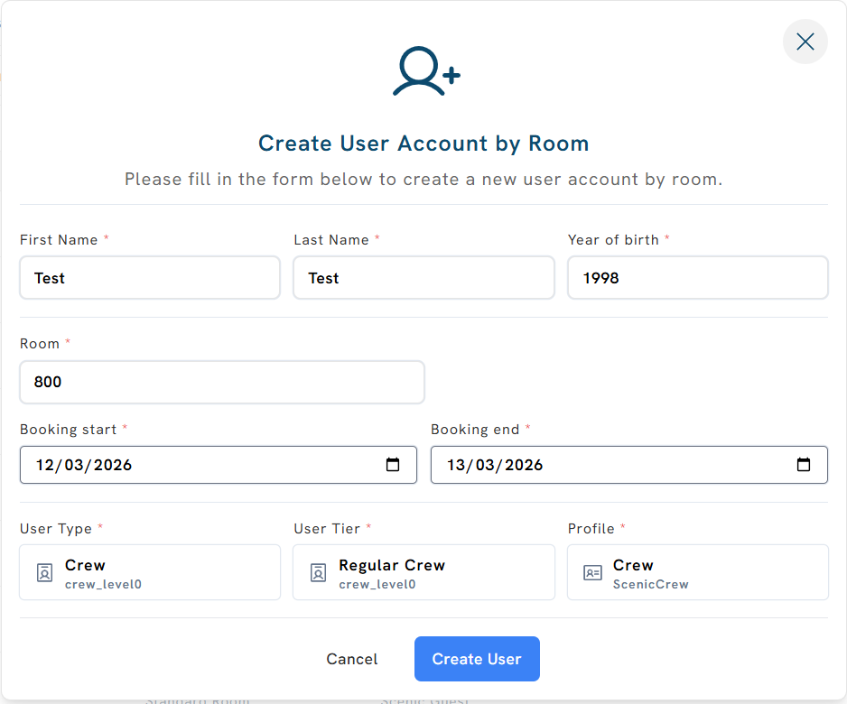
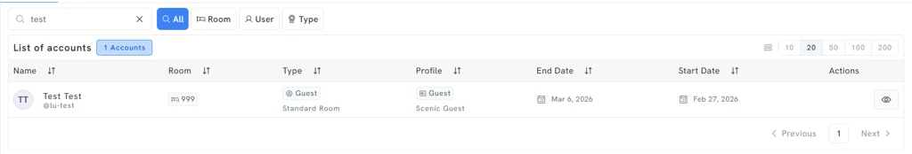
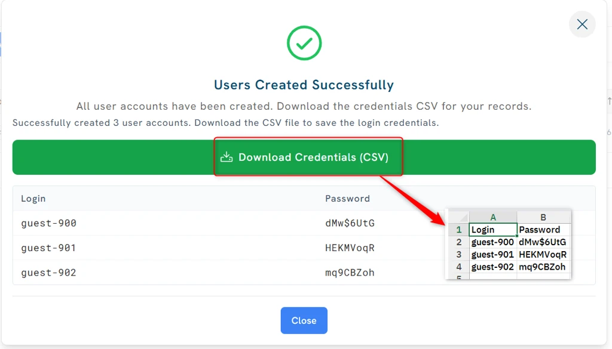

# Source Extract — Unity Local Admin

## Source identity

| Field | Value |
| --- | --- |
| Page id | 1566081037 |
| Title | Unity Local Admin |
| Space | Captive Portal (key: `CP`) |
| Author | Luis Pico |
| Last modified | May 28, 2026 |
| URL | https://redevelopment-omniaccess.atlassian.net/wiki/spaces/CP/pages/1566081037/Unity+Local+Admin |

**Course focus:** "unity local admin usage and benefits." The whole page is below;
sections most relevant to that focus are *Access*, *What is the Unity Local Admin?*,
and *Main functionalities* (Monitoring, Deleting users, Creating users).

**Completeness:** 100% of the page body was read (markdown + HTML formats). All 5
prose sections, the embedded TOC macro, the info/warning panels, and every image
were captured. All 19 image attachments were downloaded and visually inspected.
Nothing was truncated. PII appearing in screenshots (guest names, usernames,
device MACs) is preserved only as it visibly appears in illustrative screenshots —
no bulk PII rows exist in the page text.

## Table of contents

1. Local Admin Installation
2. Access
3. Initial notes and recommendations
   - What is the Unity Local Admin?
4. Main functionalities
   - Monitoring (User types and tiers; Profiles)
   - Deleting users
   - Creating users (by Room; via Voucher; via Voucher Bulk)
5. Docker - service
6. Appendix: extra attachment (network diagram)

## Images

| # | data-id | filename | dims (WxH) | saved path |
| --- | --- | --- | --- | --- |
| 1 | 40ea931e-2899-4bd0-ab8a-44305872456b | image-20260528-094132.png | 520x800 | ../images/920a33b7-fc03-44ce-8686-ddb61d39ad1a/1566081037-1-image-20260528-094132.png |
| 2 | 0e8660f8-f2ec-4e4e-8b46-91d180261adc | image-20260505-104845.png | 378x195 | ../images/920a33b7-fc03-44ce-8686-ddb61d39ad1a/1566081037-2-image-20260505-104845.png |
| 3 | 74904f62-144e-445b-95bb-e662669cd38b | image-20260505-104756.png | 509x400 | ../images/920a33b7-fc03-44ce-8686-ddb61d39ad1a/1566081037-3-image-20260505-104756.png |
| 4 | (unreferenced attachment) | Untitled Diagram-1773421167195.drawio.png | network diagram | ../images/920a33b7-fc03-44ce-8686-ddb61d39ad1a/1566081037-4-Untitled Diagram-1773421167195.drawio.png |
| 5 | 23f45aff-4b6f-4f9d-9fa5-a00bf17eee6d | image-20260314-004354.png | 1900x907 | ../images/920a33b7-fc03-44ce-8686-ddb61d39ad1a/1566081037-5-image-20260314-004354.png |
| 6 | a95b6be1-2c37-46b9-89f8-810fa8ed4f8e | image-20260312-104656.png | 1024x141 | ../images/920a33b7-fc03-44ce-8686-ddb61d39ad1a/1566081037-6-image-20260312-104656.png |
| 7 | bd75f554-ea3f-4714-9a46-e49aa66e4105 | image-20260312-104633.png | 1024x585 | ../images/920a33b7-fc03-44ce-8686-ddb61d39ad1a/1566081037-7-image-20260312-104633.png |
| 8 | b7a26645-9beb-47d8-9c82-070597029204 | image-20260312-104614.png | 1024x678 | ../images/920a33b7-fc03-44ce-8686-ddb61d39ad1a/1566081037-8-image-20260312-104614.png |
| 9 | 1e3fd497-2462-4de7-9ce5-b489a0833e6b | image-20260312-104545.png | 1024x174 | ../images/920a33b7-fc03-44ce-8686-ddb61d39ad1a/1566081037-9-image-20260312-104545.png |
| 10 | 78735efc-518b-4e3b-9784-12205d21d350 | image-20260312-104514.png | 942x767 | ../images/920a33b7-fc03-44ce-8686-ddb61d39ad1a/1566081037-10-image-20260312-104514.png |
| 11 | f3f24049-5c71-49ed-a2cc-3671f9673cbd | image-20260312-104447.png | 1024x500 | ../images/920a33b7-fc03-44ce-8686-ddb61d39ad1a/1566081037-11-image-20260312-104447.png |
| 12 | a834019a-c238-4dbf-af8b-a929b2d89534 | image-20260312-104847.png | 1955x326 | ../images/920a33b7-fc03-44ce-8686-ddb61d39ad1a/1566081037-12-image-20260312-104847.png |
| 13 | 368e484b-c880-4ab5-aa06-fc74cfbb21a5 | image-20260312-104805.png | 1001x832 | ../images/920a33b7-fc03-44ce-8686-ddb61d39ad1a/1566081037-13-image-20260312-104805.png |
| 14 | d7d37914-d26e-4cf9-8fa1-3b868372459d | image-20260312-104922.png | 1958x918 | ../images/920a33b7-fc03-44ce-8686-ddb61d39ad1a/1566081037-14-image-20260312-104922.png |
| 15 | 972633be-c36b-425f-ba25-84b304a162f8 | image-20260312-103920.png | 1955x845 | ../images/920a33b7-fc03-44ce-8686-ddb61d39ad1a/1566081037-15-image-20260312-103920.png |
| 16 | 4ef72bbb-68c9-4f1d-87bf-44fcaf48ee2d | image-20260312-103330.png | 1955x845 | ../images/920a33b7-fc03-44ce-8686-ddb61d39ad1a/1566081037-16-image-20260312-103330.png |
| 17 | 30d6fb39-df5d-4997-b4ec-dde4a9eb0e29 | image-20260312-103031.png | 1958x972 | ../images/920a33b7-fc03-44ce-8686-ddb61d39ad1a/1566081037-17-image-20260312-103031.png |
| 18 | 051ff932-25cf-4c49-8402-1a8cc2a9848a | image-20260312-102551.png | 1964x905 | ../images/920a33b7-fc03-44ce-8686-ddb61d39ad1a/1566081037-18-image-20260312-102551.png |
| 19 | 94446078-c4ce-45e0-9983-13bfaeb82c01 | image-20260312-102232.png | 1968x954 | ../images/920a33b7-fc03-44ce-8686-ddb61d39ad1a/1566081037-19-image-20260312-102232.png |

All 19 images downloaded and read OK (none failed, none described-only).

---

# Local Admin Installation

1. Upgrade Unity to version **4.1.8 (at least)**.
2. Add Ucopia controller in Unity DB with rundeck → **Ucopia** rundeck job:
   `https://omniscripting.omniaccess.com:4443/project/OA_Services/job/show/8707365f-cef8-4114-821c-19faab0b75d8`

   

   The Ucopia controller config form. Fields shown: **Unity IP** and **Unity Serial**
   (both marked with red "do not touch" arrows — leave blank/untouched), **Ucopia IP**
   = `10.254.150.5`, **Ucopia LDAP Admin** = (ucopia password), **Vessel Type** =
   `viking`, with selectable options `viking - Viking (only read)` and `yacht - Yacht`.

3. Add CP controller in Unity DB with rundeck → **Captive Portal** rundeck job:
   `https://omniscripting.omniaccess.com:4443/project/OA_Services/job/show/c0035e91-0885-4808-8546-5c70f0a15118`

   

   The CP controller config form. Fields: **Unity IP** and **Unity Serial** (left
   blank), **Cruise KVM IP** = `10.254.149.10` (red "do not touch" arrow points to it).

4. Make sure that **User Access Management** is visible.

   

   Unity "Admin page" (dated May 28, 10:46 AM) for user **superadmin** (role
   UNITY/SUPERADMIN). A **Permissions** card offers "Restore All → Resync" and
   "Rebuild Permissions → Rebuild". A **Features Addons** list has toggle switches:
   Bonding, Choose My Ip, Connectivity Management, Cybersecurity, Sd Wan, User
   Cruises Management, **User Access Management** (highlighted in a red box, toggled
   ON — this is the one to enable), Wan Health, Wan Selection.

# Access

The Unity Local Admin is a set of dashboards in Unity GUI:

Full Unity GUI screenshot of the **User Cruises Management** area showing the
**Accounts** dashboard with a list of accounts (473 accounts). Left nav under
"USER CRUISES MANAGEMENT" lists: Profiles, **Accounts**, User Tiers, User Types,
Purchases, Consolidations — with **Purchases** and **Consolidations** annotated
in red as "not used". Account rows show Room, Type (Guest – Standard Room),
Profile (Emerald Guest / Standard Guest), End Date, Start Date, and an eye (view)
action. [PII visible in illustrative screenshot: guest names — not transcribed.]

> ℹ️ **NOTE.** Purchases and Consolidation dashboards **DO NOT WORK** on Unity
> version 4.1.8.

# Initial notes and recomendations

> ⚠️ **WARNING:** Please be aware that this is not a Unity Local Admin guide. The
> **in-depth technical details should be provided by the Devel team.**

## What is the Unity Local Admin?

The **Unity Local Admin** is a dashboard in Unity thought to be a **point of
visibility and control of the Captive Portal**. It is needed at least **Unity
version 4.1.8** to install the Local Admin in Unity.

# Main functionalities

## Monitoring

There are a few tabs in Unity that provide information regarding the Captive Portal.

### User types and tiers

Currently we defined **2 types of users (Guest and Crew)** and there are **2 tiers
per type**:

| User type | Tier 1 | Tier 2 |
| --- | --- | --- |
| Guest | Standard | VIP |
| Crew | Regular | Executive |

The **User Types** tab (breadcrumb User-Cruises-Management / User-Types). Two
cards:
- **Usertype: Guest** — name `guest`, description Guest, **Default tier
  `guest_level0`**, 2 tiers, **545 users**. Associated Tiers: **Standard Room**
  (`guest_level0`) and **VIP Room** (`guest_level1`).
- **Usertype: Crew** — name `crew`, description Crew, **Default tier `crew_level0`**,
  2 tiers, **55 users**. Associated Tiers: **Regular Crew** (`crew_level0`) and
  **Crew Executive** (`crew_level1`).

### Profiles

Each of the tiers has a "default" profile assigned that defines their quota, number
of max devices, etc. This is **only a preconfiguration** — it is possible to assign
different profiles to every tier. For example, in **Scenic/Emerald**:

- User tier = Regular Crew → Default profile = **Crew**
  - User tier = Regular Crew → Available profiles that can be applied = **Crew and
    CrewExecutive**

The **Profiles** tab (filtered "By Guest Type"). Table columns: Name, User Type,
Level, Base Price, Max Devices, Quota, Mxp Id, Day/Week. Rows:

| Group | Name | User Type | Level | Base Price | Max Devices | Quota | Mxp Id | Day/Week |
| --- | --- | --- | --- | --- | --- | --- | --- | --- |
| Guest: Standard Room | Guest | Guest / Standard Room | 0 | Free | 2 | 20 GB | N/A | 4/2/2026 |
| Guest: VIP Room | GuestVIP | Guest / VIP Room | 1 | Free | 2 | 20 GB | N/A | 4/2/2026 |
| Crew: Regular Crew | Crew | Crew / Regular Crew | 0 | Free | 2 | 2 GB | N/A | 4/2/2026 |
| Crew: Crew Executive | CrewExecutive | Crew / Crew Executive | 1 | Free | 2 | 5 GB | N/A | 4/2/2026 |

**Accounts** is the main dashboard for user monitoring. You can see room, profile,
start and end date of the cruise. Click the **Eye button** on the right to see
detail per user:

The **Accounts** dashboard, "List of accounts" (537 accounts), search bar with
filters All / Room / User / Type. Columns: Name, Room, Type, Profile, End Date,
Start Date, Actions. A red arrow points to the **eye (view) icon** in the Actions
column. [PII: guest names visible in screenshot, not transcribed.]

- **Per user view:** information from user, profile, quota and device traffic.

  

  Per-user detail page (username 7589681). **Information from Guest:** Last Name
  GUIGON, First Name ADELLE MARIE, Username 7589681, Status **Active**, Room 208,
  User Tier **Standard Room**, Type Guest, Profile Guest, Valid from 09/03/2026,
  Valid until 16/03/2026. **Profile Info:** Profile Name Guest, Profile Status
  Enabled, User Type Guest, Controller Profile `Guest - guest_level0`, Profile
  Level 0. **Quota** gauge: **5.3% used = 1.06 GB / 20.00 GB Contracted**, next
  quota renewal in 6 hours. **Table of Devices:** two MACs (`0e:30:bb:c4:fc:d9`,
  `a6:2d:b1:df:1f:1b`), both Offline / 0 sessions. **Top Apps (48h):** no data.
  Left rail user actions visible: Extend Validity, Block User, Kick User, Delete
  User; Profile actions: Change Profile; Device actions: Add Device, Remove Device.
  [PII: one sample guest's name/devices visible in screenshot.]

## Deleting users

This functionality deletes the user details in **CP Database** and also in
**Ucopia**. **Deletes the user completely from the system.**

The same per-user detail page as above (Adelle Marie Guigon, room 208). The **Delete
User** action in the left "USER ACTIONS" rail is highlighted in a red box — this is
the control that removes the user from both CP DB and Ucopia.

## Creating users

The following methods **do not use CruisePAL** to authenticate the users. The users
are created in the **Captive Portal database**.

### Creating user by Room

This will create a user with a firstname, lastname and room number associated.

The Accounts dashboard with the **Create User** dropdown open showing three options:
**Create User by Room** (highlighted), Create User by Voucher, Create Users by
Voucher (Bulk).

The **Create User Account by Room** modal. Required fields: First Name (Test), Last
Name (Test), Year of birth (1998), Room (800), Booking start (12/03/2026), Booking
end (13/03/2026), User Type (Crew / crew_level0), User Tier (Regular Crew /
crew_level0), Profile (Crew / ScenicCrew). Buttons: Cancel, **Create User**.

- **Format of the user created:**

  

  Search filtered by Room "800" → 1 account: **TEST TEST**, username
  `@lu-25bab4e466974fd`, Room 800, Type Crew / Regular Crew, Profile Crew / Scenic
  Crew, Start Mar 12 2026, End Mar 13 2026. (Room-created users get an auto-generated
  `lu-<hash>` username.)

### Creating user via Voucher

This will create a pair of username/password.

The Accounts dashboard (473 accounts; sample rows `lu-guest-030`…`lu-guest-055`,
Guest / Standard Room / Scenic Guest) with the **Create User** dropdown open and
**Create User by Voucher** highlighted.

The **Create User Account by Voucher** modal ("create a new user account using
voucher credentials"). Fields: First Name (Test), Last Name (Test), **Login /
Username (test)**, **Password (1234)**, Room (999), Booking start (27/02/2026),
Booking end (06/03/2026), User Type (Guest / guest_level0), User Tier (Standard Room
/ guest_level0), Profile (Guest / ScenicGuest). Buttons: Cancel, **Create User**.

- **Format of the user created:**

  

  Search "test" → 1 account: **Test Test**, username `@lu-test`, Room 999, Guest /
  Standard Room, Profile Guest / Scenic Guest, Start Feb 27 2026, End Mar 6 2026.
  (Voucher users get a `lu-<login>` username built from the chosen login.)

### Creating user via Voucher (Bulk)

This will create a bulk of username/password combinations. It also generates a
**CSV** that you can download and provide to the Hotel Manager (or he can download
it himself).

> ⚠️ **WARNING:** Please create the **Login Prefix/Seed in lowercase letters** —
> currently there is a bug with uppercase.

The **Create User Accounts by Voucher (Bulk)** modal. **Common Settings:** Booking
Start (27/02/2026), Booking End (06/03/2026), User Type (Guest / guest_level0),
User Tier (Standard Room / guest_level0), Profile (Guest / ScenicGuest). **User
Generation:** Login Prefix/Seed (`guest`, with a red "LOWERCASE" arrow pointing at
it), Start # (1), Quantity (3), Pass Length (8), then step **(1) Generate** button
and an Import dropdown, a "Use same password for all users" checkbox, and step
**(2) Review Users** button.

The **Users Created Successfully** confirmation modal: "Successfully created 3 user
accounts. Download the CSV file to save the login credentials." A green **Download
Credentials (CSV)** button is highlighted, with an inset showing the CSV columns
Login / Password. Sample rows: `guest-900 / dMw$6UtG`, `guest-901 / HEKMVoqR`,
`guest-902 / mq9CBZoh`. Close button at bottom.

- **Format of the user created:**

  

  Three resulting accounts: `lu-guest-900`, `lu-guest-901`, `lu-guest-902` — all
  Guest / Standard Room, Profile Guest / **Emerald Guest**, Start Feb 27 2026, End
  Mar 6 2026. (Bulk users get `lu-<seed>-<number>` usernames.)

# Docker - service

| Service | Image |
| --- | --- |
| user-cruise-services | `gitlab.omniaccess.com:5001/development/cartels/cruise-portal:1.4.47` |
| user-quota-services | `gitlab.omniaccess.com:5001/development/unity/cartels/ucopia:feat-oae-1406.1` |

# Appendix: extra attachment (network diagram)

The page has one additional image attachment (`Untitled Diagram-1773421167195.drawio.png`)
that is **not embedded in the page body** but is attached to the page. It is included
here for completeness as it documents the underlying network topology behind the
Captive Portal / Ucopia integration.

A drawio network diagram. **FORTIGATE** firewall contains **VRF 0** and a nested
**VRF 30** (`transit2_vrf_0`). Interfaces/links:
- VRF 0 `transit2_vrf_30` .1 ←(VLAN 155)→ **vmbr1**; VRF 30 `transit2_vrf_0` .2 →(VLAN 155)→ vmbr1.
- VRF 30 `uc_out` .1 ←(VLAN 151)→ **UCOPIA** OUT .2.
- VRF 0 `uc_in` .2 →(VLAN 149)→ UCOPIA IN .1.
- VRF 0 `uc_mgmt` .1 →(VLAN 150)→ UCOPIA MGMT .5.
- VRF 0 .1 →(VLAN 199, **10.254.199.0/24**)→ **MIKROTIK** .2.
- VRF 0 `transit2_vrf_30` .1 → **INTERNET** (cloud).
