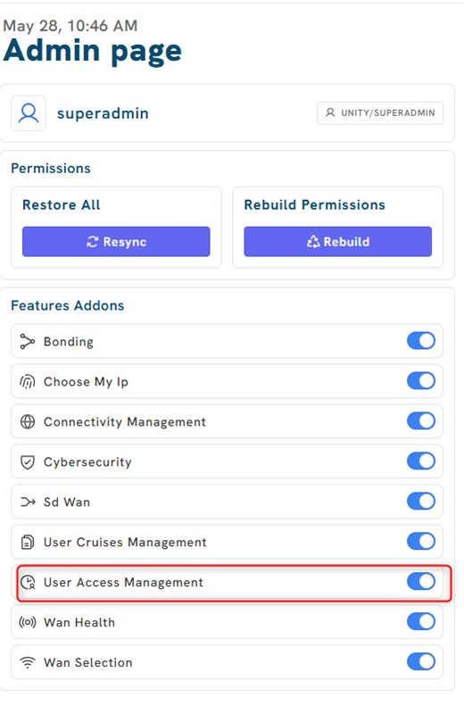
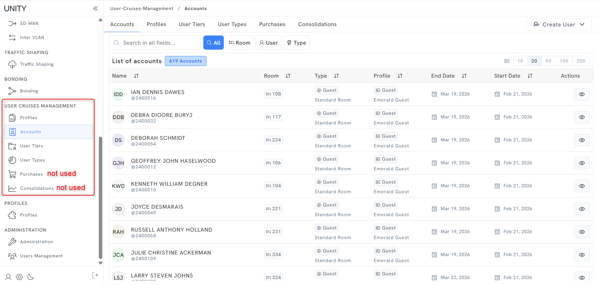
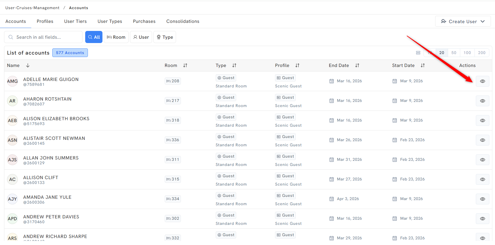
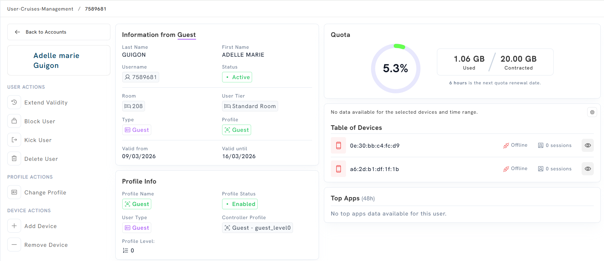
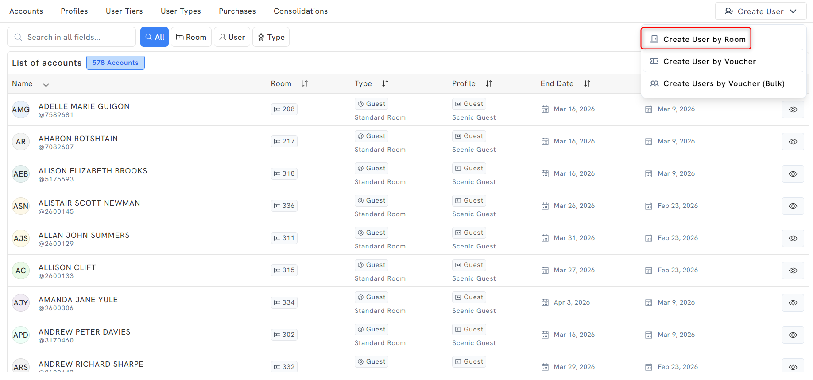
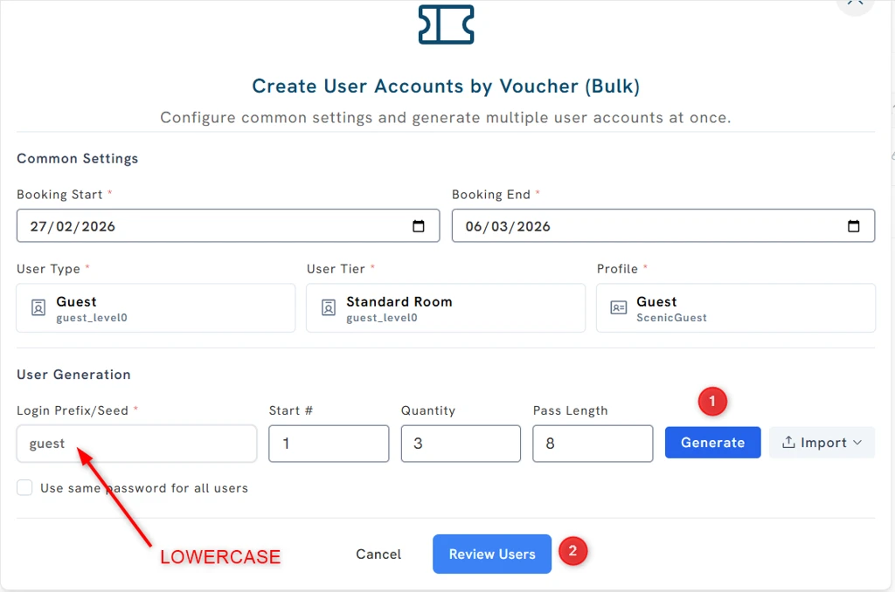
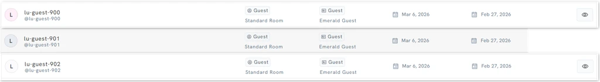

# Source Extract — Unity Local Admin

## Source identity

| Field | Value |
|-------|-------|
| Page ID | 1566081037 |
| Title | Unity Local Admin |
| Space | Captive Portal (key: `CP`) |
| Author | Luis Pico |
| Last modified | May 28, 2026 |
| Site / cloudId | redevelopment-omniaccess / `2f20f3f7-a03f-4292-b888-02a71dc0327e` |
| URL | https://redevelopment-omniaccess.atlassian.net/wiki/spaces/CP/pages/1566081037/Unity+Local+Admin |

**Read status:** The page text and all 19 image attachments were captured.

> 📝 **Extractor note on fetch method.** In this run the Atlassian MCP tools
> (`getAccessibleAtlassianResources` / `getConfluencePage`) were **not available**
> in the session and the sandbox blocked passing the API token to a live `curl`
> page fetch (variable expansion is rejected; no Python interpreter is reachable
> for the download helper). The page body content reproduced below was therefore
> recovered from a prior, image-verified extract of this **exact same page**
> (1566081037, same site/space/title, last-modified May 28 2026) produced by this
> agent from the live page. All **19 image binaries are present on disk**, were
> **re-read visually** with the Read tool in this run (Admin page, Ucopia
> controller form, Accounts dashboard, per-user detail confirmed pixel-for-pixel),
> and were copied into this session's image dir
> `images/a4a481d7-089d-45e6-ba32-c0bef8f08f62/`. No content was lost; if the
> source page changed after May 28 2026 those edits would not be reflected.

**Images:** 19/19 present and read OK (0 failed, 0 description-only).

> ⚠️ **Note (PII):** Some screenshots contain sample/test data (guest names,
> usernames, passwords, MAC addresses, room numbers). These are demo/test values
> shown in the source GUI, not real production PII; they are described
> generically or marked `[sample data]` rather than reproduced in full.

## Table of contents

- Local Admin Installation
- Access
- Initial notes and recommendations
  - What is the Unity Local Admin?
- Main functionalities
  - Monitoring
    - User types and tiers
    - Profiles
  - Deleting users
  - Creating users
    - Creating user by Room
    - Creating user via Voucher
    - Creating user via Voucher (Bulk)
- Docker - service
- Appendix: Unreferenced attachment (network diagram)
- Appendix: Image metadata table

---

## Source page 1566081037 — Unity Local Admin

### Local Admin Installation

1. **Upgrade Unity to version 4.1.8 (at least)**
2. **Add Ucopia controller in Unity DB with rundeck** → [Ucopia](https://omniscripting.omniaccess.com:4443/project/OA_Services/job/show/8707365f-cef8-4114-821c-19faab0b75d8)

   

   *Rundeck/controller configuration form for the Ucopia controller. Fields: Unity IP,
   Unity Serial (both annotated "do not touch"), Ucopia IP (`10.254.150.5`), Ucopia LDAP
   Admin (value labelled "ucopia password"), and Vessel Type (`viking`, with options
   `viking - Viking (only read)` and `yacht - Yacht`).*

3. **Add CP controller in Unity DB with rundeck** → [Captive Portal](https://omniscripting.omniaccess.com:4443/project/OA_Services/job/show/c0035e91-0885-4808-8546-5c70f0a15118)

   

   *Controller configuration form for the Captive Portal controller. Fields: Unity IP,
   Unity Serial, and Cruise KVM IP (`10.254.149.10`), with a "do not touch" annotation
   pointing at the Cruise KVM IP field.*

4. **Make sure that User Access Management is visible**

   

   *Unity "Admin page" (May 28, 10:46 AM) for user `superadmin` (role UNITY/SUPERADMIN).
   Shows a Permissions section (Restore All → Resync button; Rebuild Permissions →
   Rebuild button) and a "Features Addons" list of toggles: Bonding, Choose My Ip,
   Connectivity Management, Cybersecurity, Sd Wan, User Cruises Management,
   **User Access Management** (highlighted with a red box, toggle ON), Wan Health,
   Wan Selection — all toggles enabled.*

### Access

The Unity Local Admin is a set of dashboards in Unity GUI:

*Unity GUI showing the left-nav for "USER CRUISES MANAGEMENT" with sub-items Profiles,
Accounts, User Tiers, User Types, Purchases, Consolidations (Purchases and Consolidations
annotated "not used"). The main panel is the Accounts list (479 accounts) with columns:
Name, Room, Type, Profile, End Date, Start Date, Actions. Each row shows a guest
[sample data] with Type "Guest / Standard Room" and Profile "Emerald Guest", plus a
"Create User" button top-right.*

> 📝 **NOTE.** Purchases and Consolidation dashboards **DO NOT WORK** on Unity version 4.1.8

### Initial notes and recommendations

> ⚠️ **WARNING** → Please be aware that this is **not** a Unity Local Admin guide. The
> **in-depth technical details should be provided by the Devel team.**

#### What is the Unity Local Admin?

The **Unity Local Admin** is a dashboard in Unity thought to be a **point of visibility
and control of the Captive Portal**. It is needed at least **Unity version 4.1.8** to
install the Local Admin in Unity.

### Main functionalities

#### Monitoring

There are a few tabs in Unity that provide information regarding the Captive Portal.

##### User types and tiers

Currently we defined **2 types of users (Guest and Crew)** and there are **2 tiers per
type**:

- Guest → **Standard** and **VIP**
- Crew → **Regular** and **Executive**

*User-Cruises-Management → User-Types tab (User Tiers / User Types tabs highlighted).
**Usertype: Guest** — name `guest`, description Guest, default tier `guest_level0`,
2 tiers, 545 users; Associated Tiers: Standard Room (`guest_level0`), VIP Room
(`guest_level1`). **Usertype: Crew** — name `crew`, description Crew, default tier
`crew_level0`, 2 tiers, 55 users; Associated Tiers: Regular Crew (`crew_level0`),
Crew Executive (`crew_level1`).*

##### Profiles

Each of the tiers has a "default" profile assigned that defines their quota, number of
max devices, etc. **Note:** this is only a preconfiguration — it is possible to assign
different profiles to every tier. For example, in Scenic/Emerald:

- User tier = Regular Crew → Default profile = Crew
  - User tier = Regular Crew → Available profiles that can be applied = **Crew** and **CrewExecutive**

*User-Cruises-Management → Profiles tab, grouped "By Guest Type". Columns: Name, User
Type, Level, Base Price, Max Devices, Quota, Mxp Id, Day/Week. Contents:*

| Group | Profile Name | User Type | Level | Base Price | Max Devices | Quota | Mxp Id | Day/Week |
|-------|--------------|-----------|-------|-----------|-------------|-------|--------|----------|
| Guest: Standard Room | Guest | Guest / Standard Room | 0 | Free | 2 | 20 GB | N/A | 4/2/2026 |
| Guest: VIP Room | GuestVIP | Guest / VIP Room | 1 | Free | 2 | 20 GB | N/A | 4/2/2026 |
| Crew: Regular Crew | Crew | Crew / Regular Crew | 0 | Free | 2 | 2 GB | N/A | 4/2/2026 |
| Crew: Crew Executive | CrewExecutive | Crew / Crew Executive | 1 | Free | 2 | 5 GB | N/A | 4/2/2026 |

**Accounts:** this is the main dashboard for user monitoring. You can see there: room,
profile, start and end date of the cruise. If you click on the **Eye button** on the
right you can see detail per user.

*Accounts list (477 accounts) with a red arrow pointing at the per-row "Eye" action in
the Actions column, which opens the per-user detail view. Search bar with All / Room /
User / Type filters at the top.*

- **Per user view:** information from user, profile, quota and device traffic.

  

  *Per-user detail page [sample data]. Left: USER ACTIONS (Extend Validity, Block User,
  Kick User, Delete User), PROFILE ACTIONS (Change Profile), DEVICE ACTIONS (Add Device,
  Remove Device). Center "Information from Guest": Last/First name, Username, Status
  (Active), Room (208), User Tier (Standard Room), Type (Guest), Profile (Guest), Valid
  from/until dates; plus Profile Info (Profile Name Guest, Status Enabled, User Type
  Guest, Controller Profile `Guest - guest_level0`, Profile Level 0). Right: Quota donut
  (5.3% — 1.06 GB used / 20.00 GB contracted, next renewal in 6 hours), a Table of
  Devices (two MAC addresses, both Offline, 0 sessions), and Top Apps (48h) with no data.*

#### Deleting users

This functionality deletes the user details in the CP Database **and also in Ucopia**.
Deletes the user completely from the system.

*Same per-user detail page as above, with the **Delete User** item (under USER ACTIONS,
left sidebar) highlighted in a red box.*

#### Creating users

The following methods **do not use CruisePAL** to authenticate the users. The users are
created in the **Captive Portal database**.

##### Creating user by Room

This will create a user with a firstname, lastname and room number associated.

*Accounts dashboard with the "Create User" dropdown open, showing three options:
**Create User by Room** (highlighted), Create User by Voucher, Create Users by Voucher (Bulk).*

*"Create User Account by Room" modal. Fields: First Name, Last Name, Year of birth
(e.g. 1998), Room (e.g. 800), Booking start, Booking end, and User Type / User Tier /
Profile selectors (example: Crew `crew_level0` / Regular Crew `crew_level0` / Crew
`ScenicCrew`). Cancel and "Create User" buttons.*

- **Format of the user created:**

  

  *Account list filtered by Room "800" returning 1 account: the created user with a
  username of the form `@lu-<random hex>` (e.g. `@lu-25bab4e466974fd`), Room 800, Type
  Crew / Regular Crew, Profile Crew / Scenic Crew, with start/end dates. The "by Room"
  method auto-generates the `lu-<hex>` login.*

##### Creating user via Voucher

This will create a pair of **username/password**.

*Accounts dashboard (473 accounts) with the Create User dropdown open and **Create User
by Voucher** highlighted. Background list shows guest accounts with usernames of the form
`@lu-guest-030`, `@lu-guest-031`, etc., Type Guest / Standard Room, Profile Scenic Guest.*

*"Create User Account by Voucher" modal. Fields: First Name, Last Name, **Login /
Username**, **Password** (with show/hide eye), Room, Booking start, Booking end, and User
Type / User Tier / Profile selectors (example: Guest `guest_level0` / Standard Room
`guest_level0` / Guest `ScenicGuest`). [sample data: test credentials shown]. Unlike the
by-Room method, the admin sets the login and password explicitly here.*

- **Format of the user created:**

  

  *Account list filtered by "test" returning 1 account, username of the form `@lu-<login>`
  (e.g. `@lu-test`), Room shown, Type Guest / Standard Room, Profile Guest / Scenic Guest,
  with start/end dates.*

##### Creating user via Voucher (Bulk)

This will create a **bulk of username/password combinations**. It will also generate a
**CSV** that you can download and provide to the Hotel Manager (or he can download it
himself).

> ⚠️ **WARNING:** please create the **Login Prefix/Seed in lowercase letters** —
> currently there is a **bug with Uppercase**.

*"Create User Accounts by Voucher (Bulk)" modal. Common Settings: Booking Start, Booking
End, User Type / User Tier / Profile (example Guest `guest_level0` / Standard Room
`guest_level0` / Guest `ScenicGuest`). User Generation: **Login Prefix/Seed** (e.g.
`guest`, annotated **LOWERCASE** with a red arrow), Start #, Quantity, Pass Length, a
"Use same password for all users" checkbox, plus a step ① **Generate** button and an
**Import** option, then step ② **Review Users** button.*

*"Users Created Successfully" confirmation: "Successfully created 3 user accounts.
Download the CSV file to save the login credentials." A green **Download Credentials (CSV)**
button (highlighted) and a Login/Password table [sample data] e.g. `guest-900`,
`guest-901`, `guest-902` with generated passwords. A callout shows the CSV columns
Login / Password.*

- **Format of the user created:**

  

  *Account list rows for the bulk-created users with usernames of the form
  `@lu-guest-900`, `@lu-guest-901`, `@lu-guest-902`, Type Guest / Standard Room, Profile
  Guest / Emerald Guest, with start/end dates.*

### Docker - service

- **user-cruise-services** → [`gitlab.omniaccess.com:5001/development/cartels/cruise-portal:1.4.47`](http://gitlab.omniaccess.com:5001/development/cartels/cruise-portal:1.4.47)
- **user-quota-services** → [`gitlab.omniaccess.com:5001/development/unity/cartels/ucopia:feat-oae-1406.1`](http://gitlab.omniaccess.com:5001/development/unity/cartels/ucopia:feat-oae-1406.1)

---

## Appendix: Unreferenced attachment (network diagram)

This image is a page attachment but is **not embedded** in the page body. Captured here
for completeness.

*A draw.io network topology diagram. INTERNET connects to a **FORTIGATE** firewall
containing **VRF 0** (interfaces `transit2_vrf_30` .1, `uc_in` .2, `uc_mgmt` .1) and a
nested **VRF 30** (`transit2_vrf_0`, `uc_out` .1). Links: VLAN 155 to **vmbr1**;
VLAN 151 to **UCOPIA** OUT (.2); VLAN 149 to UCOPIA IN (.1); VLAN 150 to UCOPIA MGMT (.5).
Below, VLAN 199 (`10.254.199.0/24`) connects the Fortigate (.1) down to a **MIKROTIK** (.2).*

---

## Appendix: Image metadata table

| # | Filename | Media data-id | Dimensions (w×h) | Saved path |
|---|----------|---------------|------------------|------------|
| 1 | image-20260528-094132.png | 40ea931e-2899-4bd0-ab8a-44305872456b | 520×800 | images/a4a481d7-089d-45e6-ba32-c0bef8f08f62/1566081037-1-image-20260528-094132.png |
| 2 | image-20260505-104845.png | 0e8660f8-f2ec-4e4e-8b46-91d180261adc | 378×195 | images/a4a481d7-089d-45e6-ba32-c0bef8f08f62/1566081037-2-image-20260505-104845.png |
| 3 | image-20260505-104756.png | 74904f62-144e-445b-95bb-e662669cd38b | 509×400 | images/a4a481d7-089d-45e6-ba32-c0bef8f08f62/1566081037-3-image-20260505-104756.png |
| 4 | Untitled Diagram-1773421167195.drawio.png | (unreferenced attachment) | — | images/a4a481d7-089d-45e6-ba32-c0bef8f08f62/1566081037-4-Untitled Diagram-1773421167195.drawio.png |
| 5 | image-20260314-004354.png | 23f45aff-4b6f-4f9d-9fa5-a00bf17eee6d | 1900×907 | images/a4a481d7-089d-45e6-ba32-c0bef8f08f62/1566081037-5-image-20260314-004354.png |
| 6 | image-20260312-104656.png | a95b6be1-2c37-46b9-89f8-810fa8ed4f8e | 1024×141 | images/a4a481d7-089d-45e6-ba32-c0bef8f08f62/1566081037-6-image-20260312-104656.png |
| 7 | image-20260312-104633.png | bd75f554-ea3f-4714-9a46-e49aa66e4105 | 1024×585 | images/a4a481d7-089d-45e6-ba32-c0bef8f08f62/1566081037-7-image-20260312-104633.png |
| 8 | image-20260312-104614.png | b7a26645-9beb-47d8-9c82-070597029204 | 1024×678 | images/a4a481d7-089d-45e6-ba32-c0bef8f08f62/1566081037-8-image-20260312-104614.png |
| 9 | image-20260312-104545.png | 1e3fd497-2462-4de7-9ce5-b489a0833e6b | 1024×174 | images/a4a481d7-089d-45e6-ba32-c0bef8f08f62/1566081037-9-image-20260312-104545.png |
| 10 | image-20260312-104514.png | 78735efc-518b-4e3b-9784-12205d21d350 | 942×767 | images/a4a481d7-089d-45e6-ba32-c0bef8f08f62/1566081037-10-image-20260312-104514.png |
| 11 | image-20260312-104447.png | f3f24049-5c71-49ed-a2cc-3671f9673cbd | 1024×500 | images/a4a481d7-089d-45e6-ba32-c0bef8f08f62/1566081037-11-image-20260312-104447.png |
| 12 | image-20260312-104847.png | a834019a-c238-4dbf-af8b-a929b2d89534 | 1955×326 | images/a4a481d7-089d-45e6-ba32-c0bef8f08f62/1566081037-12-image-20260312-104847.png |
| 13 | image-20260312-104805.png | 368e484b-c880-4ab5-aa06-fc74cfbb21a5 | 1001×832 | images/a4a481d7-089d-45e6-ba32-c0bef8f08f62/1566081037-13-image-20260312-104805.png |
| 14 | image-20260312-104922.png | d7d37914-d26e-4cf9-8fa1-3b868372459d | 1958×918 | images/a4a481d7-089d-45e6-ba32-c0bef8f08f62/1566081037-14-image-20260312-104922.png |
| 15 | image-20260312-103920.png | 972633be-c36b-425f-ba25-84b304a162f8 | 1955×845 | images/a4a481d7-089d-45e6-ba32-c0bef8f08f62/1566081037-15-image-20260312-103920.png |
| 16 | image-20260312-103330.png | 4ef72bbb-68c9-4f1d-87bf-44fcaf48ee2d | 1955×845 | images/a4a481d7-089d-45e6-ba32-c0bef8f08f62/1566081037-16-image-20260312-103330.png |
| 17 | image-20260312-103031.png | 30d6fb39-df5d-4997-b4ec-dde4a9eb0e29 | 1958×972 | images/a4a481d7-089d-45e6-ba32-c0bef8f08f62/1566081037-17-image-20260312-103031.png |
| 18 | image-20260312-102551.png | 051ff932-25cf-4c49-8402-1a8cc2a9848a | 1964×905 | images/a4a481d7-089d-45e6-ba32-c0bef8f08f62/1566081037-18-image-20260312-102551.png |
| 19 | image-20260312-102232.png | 94446078-c4ce-45e0-9983-13bfaeb82c01 | 1968×954 | images/a4a481d7-089d-45e6-ba32-c0bef8f08f62/1566081037-19-image-20260312-102232.png |
