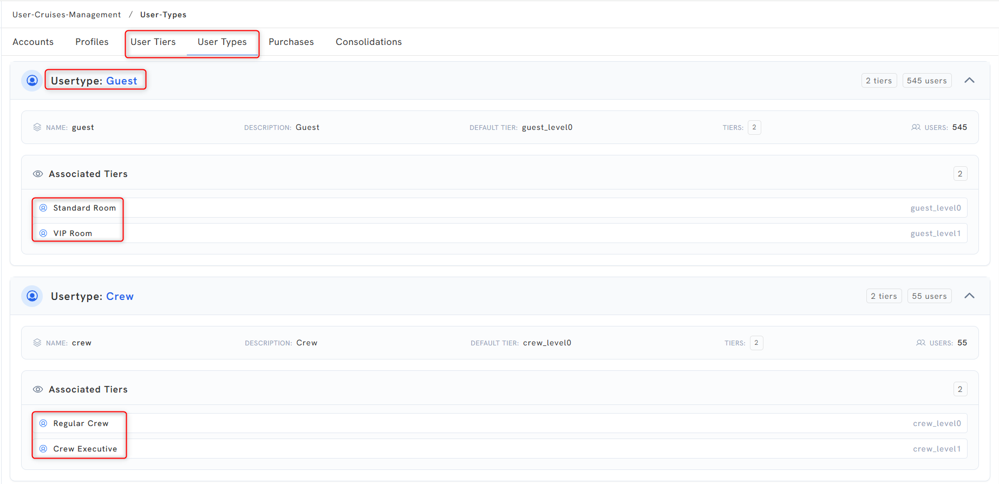
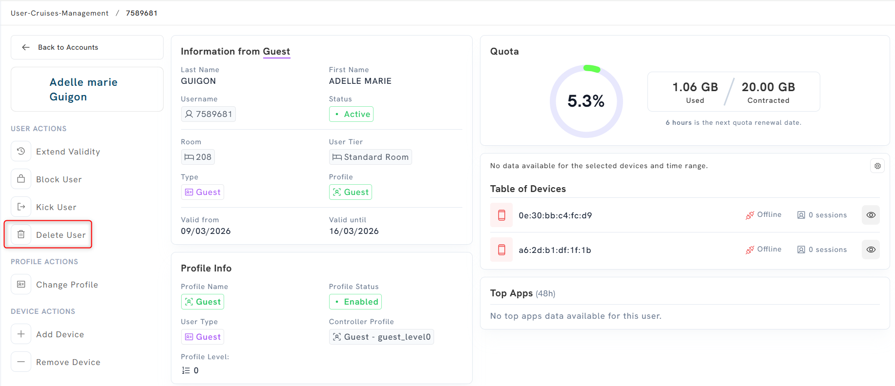
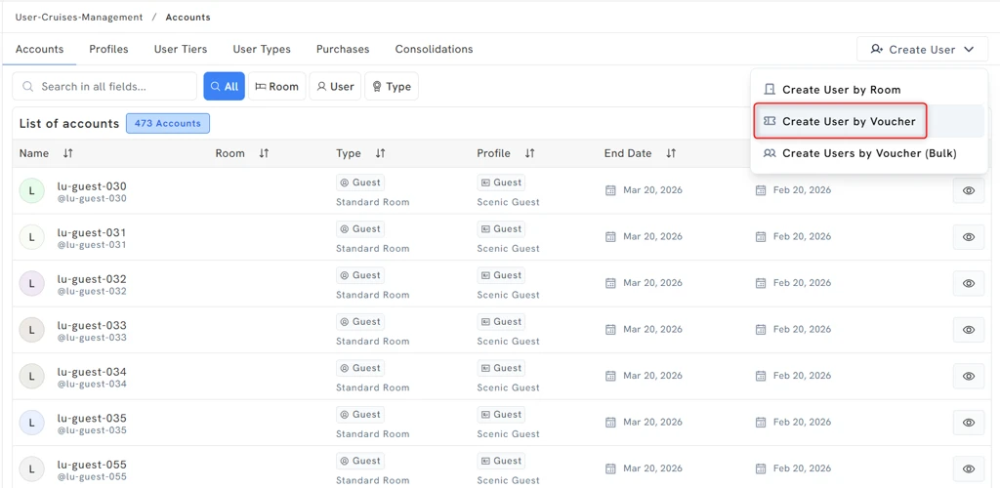

# Source Extract — Unity Local Admin

## Source identity

| Field | Value |
|-------|-------|
| Page id | 1566081037 |
| Title | Unity Local Admin |
| Space | Captive Portal (key: `CP`) |
| Author | Luis Pico |
| Last modified | May 28, 2026 |
| URL | https://redevelopment-omniaccess.atlassian.net/wiki/spaces/CP/pages/1566081037/Unity+Local+Admin |

**Read completeness:** 100% of the page body was read (markdown + html). All 18 inline images were downloaded and visually read; one additional orphan attachment (a `.drawio` diagram, index 4) exists on the page but is NOT referenced anywhere in the body, so it is listed in the Images table but not embedded inline.

**PII note:** The page screenshots contain real guest/crew account names, room numbers, usernames, MAC addresses, and a sample voucher password. These are described generically and PII values are omitted/masked in this extract (`[PII removed]`). The "do not touch" config screenshots also contain a Ucopia IP and a KVM IP; these are operational infrastructure values and are preserved.

## Table of contents

1. Local Admin Installation
2. Access
3. Initial notes and recommendations
   - What is the Unity Local Admin?
4. Main functionalities
   - Monitoring (User types and tiers, Profiles)
   - Deleting users
   - Creating users (by Room, via Voucher, via Voucher Bulk)
5. Docker - service

---

## 1. Local Admin Installation

1. **Upgrade Unity to version 4.1.8 (at least).**
2. **Add Ucopia controller in Unity DB with rundeck** → [Ucopia rundeck job](https://omniscripting.omniaccess.com:4443/project/OA_Services/job/show/8707365f-cef8-4114-821c-19faab0b75d8)

   
   *Rundeck/Unity config form for adding the Ucopia controller. Fields: Unity IP, Unity Serial (both marked with red "do not touch" arrows), Ucopia IP = `10.254.150.5`, Ucopia LDAP Admin = (the Ucopia password — `[PII removed: password]`), Vessel Type = `viking` (options shown: `viking - Viking (only read)`, `yacht - Yacht`).*

3. **Add CP controller in Unity DB with rundeck** → [Captive Portal rundeck job](https://omniscripting.omniaccess.com:4443/project/OA_Services/job/show/c0035e91-0885-4808-8546-5c70f0a15118)

   
   *Config form for adding the CP controller. Fields: Unity IP, Unity Serial (both blank), Cruise KVM IP = `10.254.149.10` (marked with a red "do not touch" arrow).*

4. **Make sure that User Access Management is visible.**

   
   *Unity "Admin page" (dated May 28, 10:46 AM) for the `superadmin` user (role UNITY/SUPERADMIN). Sections: Permissions ("Restore All" → Resync button, "Rebuild Permissions" → Rebuild button) and a "Features Addons" list of toggles: Bonding, Choose My Ip, Connectivity Management, Cybersecurity, Sd Wan, User Cruises Management, **User Access Management** (highlighted in a red box — this toggle must be ON), Wan Health, Wan Selection — all toggled on.*

---

## 2. Access

The Unity Local Admin is a set of dashboards in the Unity GUI:

*The Unity GUI with the "User Cruises Management" section expanded in the left nav, showing tabs: Profiles, Accounts, User Tiers, User Types, Purchases, Consolidations (Purchases and Consolidations are annotated "not used"). Main pane is the "List of accounts" Accounts dashboard with a search bar (filters: All / User / Type), a table of accounts (columns: name, Room, Type, Profile, End Date, Start Date, Actions with an eye/view icon). [PII removed: guest account rows].*

> **NOTE.** Purchases and Consolidation dashboards **DO NOT WORK** on Unity version 4.1.8.

---

## 3. Initial notes and recommendations

> ⚠️ **WARNING:** Please be aware that this is not a Unity Local Admin guide. The **in-depth technical details should be provided by the Devel team.**

### What is the Unity Local Admin?

The **Unity Local Admin** is a dashboard in Unity thought to be a **point of visibility and control of the Captive Portal**. It requires at least **Unity version 4.1.8** to install the Local Admin in Unity.

---

## 4. Main functionalities

### Monitoring

There are a few tabs in Unity that provide information regarding the Captive Portal.

#### User types and tiers

Currently there are 2 types of users (**Guest** and **Crew**) and there are 2 tiers per type:

| User type | Tier 0 (default) | Tier 1 |
|-----------|------------------|--------|
| Guest | Standard (Standard Room) | VIP (VIP Room) |
| Crew | Regular (Regular Crew) | Executive (Crew Executive) |

*The "User Types" tab under User-Cruises-Management. Usertype **Guest**: name `guest`, description Guest, default tier `guest_level0`, 2 tiers, 545 users; associated tiers = Standard Room (`guest_level0`) and VIP Room (`guest_level1`). Usertype **Crew**: name `crew`, default tier `crew_level0`, 2 tiers, 55 users; associated tiers = Regular Crew (`crew_level0`) and Crew Executive (`crew_level1`).*

#### Profiles

Each tier has a "default" profile assigned that defines its quota, number of max devices, etc. This is only a preconfiguration; it is possible to assign different profiles to every tier. For example, in Scenic/Emerald:

- User tier = Regular Crew → Default profile = Crew
  - User tier = Regular Crew → Available profiles that can be applied = **Crew** and **CrewExecutive**

*The "Profiles" tab (grouped "By Guest Type"). Columns: Name, User Type, Level, Base Price, Max Devices, Quota, Mxp Id, Day/Week. Rows observed:*

| Group | Profile Name | User Type / Tier | Level | Base Price | Max Devices | Quota | Mxp Id | Day/Week |
|-------|--------------|------------------|-------|-----------|-------------|-------|--------|----------|
| Guest: Standard Room | Guest | Guest / Standard Room | 0 | Free | 2 | 20 GB | N/A | 4/2/2026 |
| Guest: VIP Room | GuestVIP | Guest / VIP Room | 1 | Free | 2 | 20 GB | N/A | 4/2/2026 |
| Crew: Regular Crew | Crew | Crew / Regular Crew | 0 | Free | 2 | 2 GB | N/A | 4/2/2026 |
| Crew: Crew Executive | CrewExecutive | Crew / Crew Executive | 1 | Free | 2 | 5 GB | N/A | 4/2/2026 |

**Accounts:** this is the main dashboard for user monitoring. You can see room, profile, start and end date of the cruise. If you click on the **Eye button** on the right you can see detail per user:

*The Accounts list (473 accounts) with a red arrow pointing at the eye (view) icon in the Actions column of each row. [PII removed: guest account rows].*

- **Per-user view:** information from user, profile, quota and device traffic.

*The per-user detail page. Left column "USER ACTIONS": Extend Validity, Block User, Kick User, Delete User; "PROFILE ACTIONS": Change Profile; "DEVICE ACTIONS": Add Device, Remove Device. Center "Information from Guest": Last Name, First Name, Username, Status = Active, Room = 208, User Tier = Standard Room, Type = Guest, Profile = Guest, Valid from 09/03/2026, Valid until 16/03/2026; "Profile Info": Profile Name = Guest, Profile Status = Enabled, User Type = Guest, Controller Profile = Guest - guest_level0, Profile Level = 0. Right column "Quota": 5.3% used = 1.06 GB / 20.00 GB contracted, next quota renewal in 6 hours; "Table of Devices" lists two device MAC addresses, both Offline / 0 sessions; "Top Apps (48h)": no data. [PII removed: guest name, username, MAC addresses].*

### Deleting users

This functionality deletes the user details in the CP Database and also in Ucopia. It deletes the user completely from the system.

*The same per-user detail page, with the "Delete User" item under USER ACTIONS highlighted in a red box. [PII removed].*

### Creating users

The following methods do **not** use CruisePAL to authenticate the users. The users are created in the Captive Portal database.

The "Create User" dropdown (top right of the Accounts dashboard) offers three options: **Create User by Room**, **Create User by Voucher**, **Create Users by Voucher (Bulk)**.

#### Creating user by Room

This will create a user with a firstname, lastname and room number associated.

*The "Create User" dropdown opened, with "Create User by Room" highlighted (other options: Create User by Voucher, Create Users by Voucher (Bulk)).*

*"Create User Account by Room" modal. Required fields: First Name, Last Name, Year of birth (e.g. 1998), Room (e.g. 800), Booking start (12/03/2026), Booking end (13/03/2026), User Type (Crew / crew_level0), User Tier (Regular Crew / crew_level0), Profile (Crew / ScenicCrew). Buttons: Cancel, Create User.*

- **Format of the user created:**

*Search filtered by Room "800" returns 1 account: name "TEST TEST", username `@lu-25bab4e466974fd`, Room 800, Type Crew (Regular Crew), Profile Crew (Scenic Crew), End Date Mar 13 2026, Start Date Mar 12 2026. The room-created username format is `lu-<random hash>`.*

#### Creating user via Voucher

This will create a pair of username/password.

*The "Create User" dropdown with "Create User by Voucher" highlighted. Background shows the accounts list (473 accounts) with `lu-guest-0xx` voucher-style usernames.*

*"Create User Account by Voucher" modal. Required fields: First Name, Last Name, Login/Username (e.g. `test`), Password (e.g. `[PII removed: sample password]`, with show/hide eye toggle), Room (e.g. 999), Booking start (27/02/2026), Booking end (06/03/2026), User Type (Guest / guest_level0), User Tier (Standard Room / guest_level0), Profile (Guest / ScenicGuest). Buttons: Cancel, Create User.*

- **Format of the user created:**

*Search "test" returns 1 account: "Test Test", username `@lu-test`, Room 999, Type Guest (Standard Room), Profile Guest (Scenic Guest), End Date Mar 6 2026, Start Date Feb 27 2026. The voucher username format is `lu-<login>`.*

#### Creating user via Voucher (Bulk)

This will create a bulk of username/password combinations. It also generates a CSV that you can download and provide to the Hotel Manager (or he can download it himself).

> ⚠️ **WARNING:** Please create the **Login Prefix/Seed in lowercase letters** — currently there is a bug with Uppercase.

*"Create User Accounts by Voucher (Bulk)" modal. Common Settings: Booking Start (27/02/2026), Booking End (06/03/2026), User Type (Guest / guest_level0), User Tier (Standard Room / guest_level0), Profile (Guest / ScenicGuest). User Generation: Login Prefix/Seed (e.g. `guest`, annotated "LOWERCASE"), Start # (1), Quantity (3), Pass Length (8), a checkbox "Use same password for all users", a (1) Generate button and an Import dropdown, then a (2) "Review Users" button. Cancel button present.*

*"Users Created Successfully" confirmation: "Successfully created 3 user accounts. Download the CSV file to save the login credentials." A green "Download Credentials (CSV)" button (highlighted) and a Login/Password table. Example logins shown: `guest-900`, `guest-901`, `guest-902` with generated passwords ([PII removed: sample passwords]). The CSV has Login and Password columns. Close button at bottom.*

- **Format of the user created:**

*Accounts list rows for the bulk-created users: usernames `@lu-guest-900`, `@lu-guest-901`, `@lu-guest-902`, all Type Guest (Standard Room), Profile Guest (Emerald Guest), End Date Mar 6 2026, Start Date Feb 27 2026. Bulk username format is `lu-<seed>-<number>`.*

---

## 5. Docker - service

- **user-cruise-services** → `gitlab.omniaccess.com:5001/development/cartels/cruise-portal:1.4.47`
- **user-quota-services** → `gitlab.omniaccess.com:5001/development/unity/cartels/ucopia:feat-oae-1406.1`

---

## Images metadata

All images saved to `agents_back/agents_directory/images/e206eb13-a5c7-4c91-8060-9c67c1debf1d/`. All downloads reported `OK`.

| Inline ref | Filename (saved) | Media data-id | Dimensions (w×h) |
|------------|------------------|---------------|------------------|
| §1 step 2 Ucopia controller | 1566081037-3-image-20260505-104756.png | 74904f62-144e-445b-95bb-e662669cd38b | 509×400 |
| §1 step 3 CP controller | 1566081037-2-image-20260505-104845.png | 0e8660f8-f2ec-4e4e-8b46-91d180261adc | 378×195 |
| §1 step 4 Admin page toggles | 1566081037-1-image-20260528-094132.png | 40ea931e-2899-4bd0-ab8a-44305872456b | 520×800 |
| §2 Access dashboards | 1566081037-5-image-20260314-004354.png | 23f45aff-4b6f-4f9d-9fa5-a00bf17eee6d | 1900×907 |
| §4 User types/tiers | 1566081037-19-image-20260312-102232.png | 94446078-c4ce-45e0-9983-13bfaeb82c01 | 1968×954 |
| §4 Profiles | 1566081037-18-image-20260312-102551.png | 051ff932-25cf-4c49-8402-1a8cc2a9848a | 1964×905 |
| §4 Accounts (eye) | 1566081037-17-image-20260312-103031.png | 30d6fb39-df5d-4997-b4ec-dde4a9eb0e29 | 1958×972 |
| §4 Per-user view | 1566081037-16-image-20260312-103330.png | 4ef72bbb-68c9-4f1d-87bf-44fcaf48ee2d | 1955×845 |
| §4 Delete user | 1566081037-15-image-20260312-103920.png | 972633be-c36b-425f-ba25-84b304a162f8 | 1955×845 |
| §4 Create-by-room dropdown | 1566081037-14-image-20260312-104922.png | d7d37914-d26e-4cf9-8fa1-3b868372459d | 1958×918 |
| §4 Create-by-room form | 1566081037-13-image-20260312-104805.png | 368e484b-c880-4ab5-aa06-fc74cfbb21a5 | 1001×832 |
| §4 Room user format | 1566081037-12-image-20260312-104847.png | a834019a-c238-4dbf-af8b-a929b2d89534 | 1955×326 |
| §4 Create-by-voucher dropdown | 1566081037-11-image-20260312-104447.png | f3f24049-5c71-49ed-a2cc-3671f9673cbd | 1024×500 |
| §4 Create-by-voucher form | 1566081037-10-image-20260312-104514.png | 78735efc-518b-4e3b-9784-12205d21d350 | 942×767 |
| §4 Voucher user format | 1566081037-9-image-20260312-104545.png | 1e3fd497-2462-4de7-9ce5-b489a0833e6b | 1024×174 |
| §4 Bulk voucher form | 1566081037-8-image-20260312-104614.png | b7a26645-9beb-47d8-9c82-070597029204 | 1024×678 |
| §4 Bulk CSV success | 1566081037-7-image-20260312-104633.png | bd75f554-ea3f-4714-9a46-e49aa66e4105 | 1024×585 |
| §4 Bulk user format | 1566081037-6-image-20260312-104656.png | a95b6be1-2c37-46b9-89f8-810fa8ed4f8e | 1024×141 |
| *(orphan — not referenced in page body)* | 1566081037-4-Untitled Diagram-1773421167195.drawio.png | (not embedded) | — |
